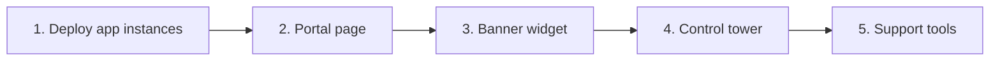

# Implementation plan for the Quackback fork

Status: first execution-plan draft, 2026-09-19. Baseline: `origin/main` at `fa68658da`, including PR #12 (second-pass fixes) and PR #13 (third-review fixes). No feature implementation has started as part of this work.

This document turns the five feature designs, their RBAC prerequisite, and the intranet deployment requirements into dependency-ordered work packages. It supplements the detailed designs rather than redefining them. A work package is a reviewable PR boundary; split it further if necessary, but preserve its atomicity and release gates. All packages below are initially **not started**.

## 1. Scope and operating rules

Deliver personas and authorization, prioritization, tiered support and the requester hub, account actions, portal/embedded announcements, and the control tower with per-app inbound mail. Keep the fork able to accept upstream changes through isolated modules, separate migration lineage, documented integration points, and behavioral regression tests.

Use these sources:

- [Decisions](01-decisions.md): approved choices and adopted defaults. Yellow defaults are implementation assumptions, not new approval requests.
- [Fork conventions](02-fork-conventions.md) and [seam registry](SEAMS.md): code ownership, migration discipline and upgrade requirements.
- [Intranet baseline](04-intranet-deployment.md): no-egress deployment, private services, SSO and model configuration.
- [RBAC](10-rbac-persona-extensions.md), [tower](20-control-tower.md), [tiers](30-tiered-support.md), [actions](40-support-account-actions.md), [scoring](50-prioritization-scoring.md), and [announcements](60-announcements-banner.md): domain contracts and acceptance tests.

The historical reviews explain why contracts exist; they are not evidence that the latest proposed fixes have passed runtime tests. Convert the R2/R3 acceptance scenarios into implementation tests at the packages below.

Development rules:

- Keep each branch based on the then-current main, with a `codex/` prefix. Do not combine an upstream upgrade with feature implementation in the same PR.
- Add fork code under the planned fork directories and tables under the fork schema. No upstream migration renumbering or broad refactoring.
- One package owns each shared registry or seam. Other features register into it. Update `SEAMS.md`, generated authorization artifacts and principal-reference declarations in the same PR as the integration.
- Authorization enforcement and deny checks are safety prerequisites, not optional Labs features. Product features start disabled. Disabling a feature must not disable protection for data already created.
- Merge backend slices behind flags; expose a capability only after its entire release gate passes. Do not release personas before REST/MCP enforcement or expose approval flows before receiver conformance and durable routing.
- Use expand-only schema changes. A rollback ordinarily returns to compatible code, keeps the data/schema, and disables the affected product surface. Do not equate disabling a flag with undoing an external action or a ticket transition.

## 2. Product phases and release milestones

The delivery order follows the owner's five phases. Foundations, authorization and recovery are enabling work inside the phase that needs them, rather than separate product milestones. Work-package numbers below remain stable references; they are **not** the execution order.

Planning assumptions: “separate app instances” means the existing plan 20 topology—separate app hostnames and tenant databases on a shared pooled runtime. It does not yet mean a separate compute stack per app. “Portal page” means the branded per-app help-hub landing page using existing knowledge-base and support pages, with richer support tooling added later. Confirm different intended meanings before changing deployment topology or portal scope.

### Phase 1 — Deploy the separate app instances

**Outcome:** two independently addressed apps are usable on the intranet, with isolated data, storage, branding and SSO. Provisioning can be operated through the CLI; no tower UI is required.

Work: IP-00/01/02/04/05, the shared-registry subset of IP-03 required by those packages, and IP-20's provisioning lifecycle. Use upstream SSO and local administration for this initial slice; fleet-managed personas and directory reconciliation arrive in Phase 4. Apply the intranet sign-in baseline before exposing an app. If email intake is required for this pilot, move IP-23 here; otherwise leave it explicitly unavailable until Phase 5.

**Gate:** two-tenant isolation, private DNS/CA and storage checks, SSO-only negative probes, backup/restore, migration/rollback compatibility and suspend/resume all pass. Run the relevant IP-25 checks before this first production release, not only at the end of the project.

### Phase 2 — Add the portal page

**Outcome:** each app has a branded employee landing page for finding answers, opening existing support pages, tracking requests and reaching existing rating flows.

Work: the landing/navigation/branding slice of IP-15 (called **IP-15a**), using upstream portal and support behavior. Add only the required UI extension points from IP-03. Show the announcement slot only when Phase 3 is available. Do not introduce tier-dependent reporting, escalation or account actions into this page yet. Requester identity/lead-claim extensions remain in IP-15b unless required by the pilot's email intake scope.

**Gate:** signed-out SSO entry, signed-in ownership checks, mobile layout, per-app branding, working support links, and no cross-app data exposure. A thin landing page must not be presented as completion of plan 30's full support hub.

### Phase 3 — Add the banner widget

**Outcome:** admins author announcements in each app; employees see them in the portal and embedded in internal applications, with live updates and the planned audience rules.

Work: IP-11/12 and the necessary IP-03/06 catalogue, authorization and registration slices. Release the full REST/MCP authorization change with any custom personas that are exposed; an early banner release can use existing upstream admin/Manager roles instead. Fleet-wide authoring waits for Phase 4.

**Gate:** transactional audit, audience isolation, revision ordering, scheduled transitions, identity refresh, private-network assets and the real edge-proxy/browser integration all pass. Include the accepted everyone-feed network boundary in deployment configuration.

### Phase 4 — Create the control tower

**Outcome:** one place to manage apps, employee access, core cross-app views/actions and announcement broadcasts.

Work: complete IP-06/07/08, IP-21/22, and the announcement slice of IP-24. Reuse the provisioner from Phase 1. The first tower supports workspace-wide persona bundles and upstream features. Tier-specific bundles/membership adapters and support-specific surfaces stay disabled until Phase 5; the tower must not import or require an unimplemented tier service. Keep the portfolio surface hidden until scoring is implemented.

**Gate:** managed-role ownership, directory observations, immediate tenant denial, silent connect, human-attributed MCP calls, Observer restrictions, partial app failure and broadcast reconciliation all pass. Complete the applicable IP-25 fleet upgrade tests.

### Phase 5 — Layer in the support tools

**Outcome:** tiered routing/escalation, SLA-aware transitions, richer requester support, reporting, automation and approved account actions work across the apps and tower.

Work in order:

1. IP-13/14: tier topology, transactional assignment/conversion/SLA primitives, durable escalation and guarded intake.
2. IP-15b/16: remaining support UI, lead claiming, reporting, workflow/macro escalation and stage emails; enable the tower's tier-membership adapter.
3. IP-17/18/19: connected-app conformance, durable execution/approval/routing and operator UI.
4. IP-23 if not brought forward: per-app inbound mail and the full email-to-requester journey.
5. IP-09/10 and the portfolio slice of IP-24: prioritization remains in scope, scheduled as a separate feedback capability within this phase. It is independent of most support tooling and can be brought forward if needed.

**Gate:** crash/race suites, receiver conformance, end-to-end requester and approval journeys, email isolation, reporting parity and the full populated-fleet upgrade/restore rehearsal in IP-25 pass. Ship Phase 5 in smaller capability releases rather than waiting for one large support release.

### Preliminary effort ranges

Assuming one experienced full-time engineer with AI assistance, including implementation, review and testing:

- Phase 1: **3–5 engineering weeks**.
- Phase 2: **1–2 weeks** for the thin portal scope above.
- Phase 3: **2–3 weeks**.
- Phase 4: **4–6 weeks**.
- Phase 5: **8–13 weeks**, including retained prioritization scope and final hardening.

Total: **18–29 engineering weeks**. These replace the previous M0–M5 estimates and must not be added to them. Early phase estimates include their own release validation. External IdP/mail/receiver work and access delays can extend calendar time; estimate again after Phase 1. Dedicated compute stacks per app, a custom portal beyond the landing page, or earlier inbound mail change the phase allocation and potentially the total.

## 3. Work packages

### IP-00 — Freeze contracts and establish the baseline

Depends on: none. Owns: this execution plan and targeted documentation corrections.

1. Record upstream/fork SHAs, toolchain, current CI outcome and a baseline of existing failures before changing application code. Inspect repository instructions again at implementation start.
2. Reconcile remaining summary/body drift: 02's unconditional `seedSystemData` wording versus 20's fork-only path; suspended-tenant default handling; the old lease-plus-sweep wording versus request-time expiration; and seam phase labels such as TW-2. Adopt the latest R3 contracts and record each reconciliation explicitly.
3. Freeze exported contracts used by more than one feature: `applyManagedRoleSet`, denial/entitlement observation helpers, the maintenance scope, `escalateTicket` with **required `expectedAssignmentSeq`**, assignment transaction callbacks, receiver execution/status protocol, and the tenant MCP capability map.
4. Assign a single owner package to `fork_tower_principals` and its migration: IP-08, despite the table being described in plan 20. Tower sync consumes it. Define the optional post-migration template/member-reconcile registration so foundations do not import unimplemented tower or tier services.

Exit: no known contradiction at these interfaces; source decision IDs and owning packages are recorded. Existing baseline failures are distinguished from regressions.

### IP-01 — Prove deployment and external contracts early

Depends on: IP-00. Runs alongside local foundation work; no production resources or third-party messages are needed to write the code plan.

Owns: plan 20 Phase 0 evidence, isolated test configuration, and a receiver contract fixture. Validate RDS Proxy/direct DSNs and pinning, S3 through the workspace storage contract, private DNS/CA, intranet IdP/broker, SSO-only bootstrap including OTP, OAuth consent/refresh, envelope-header stripping/copy behavior, and the selected internal LLM proxy. Verify proxy-exempt banner paths with a real browser in the intended deployment.

Use local doubles for CI; mark AWS/IdP/mail claims unverified until exercised in an authorized isolated environment. Record V-1–V-10 results and any selected fallback. Infrastructure values and credentials block these proofs, not unrelated local development.

Exit: each spike has a reproducible result or a precise external blocker. Production provisioning is blocked on its required proofs.

### IP-02 — Fork schema and migration runner

Depends on: IP-00. Owns: F-1/F-2, `packages/db/drizzle-fork`, `packages/db/src/fork/schema`, fork journal, `fork_settings`, fork drift checker.

Implement separate migration history, journal integrity, migration locking, upstream-first ordering on the full path, and fork-only invocation. Keep upstream drift checks meaningful and add fork drift checks. Avoid allocating feature migration numbers before their PRs merge.

Exit: clean install and populated upgrade preserve upstream data; repeated runs are no-ops; interrupted migration recovers; corrupt/gapped journals fail clearly; both drift checks detect intentional test drift.

### IP-03 — Shared extension registration and test fixtures

Depends on: IP-02. Owns: F-3–F-10, fork directories and the guard/test harness.

Add minimal registries for MCP tools, settings modules, principal re-point steps, Labs, permissions, jobs, audit types and authz classifications. Empty registries preserve upstream behavior. Create disposable single-workspace and two-workspace PostgreSQL fixtures, actor fixtures, controlled concurrency barriers and crash/retry helpers.

Exit: fork principal references are enumerated or exempted; registry isolation holds across tenants; existing CI guardrails pass with empty product registries. No duplicated feature-specific registration seam.

### IP-04 — Production image and migration/maintenance core

Depends on: IP-02/03. Owns: F-11, `Dockerfile.fork`, the `fork-provision` migration commands, maintenance scope and fork schema/catalogue state.

Implement the artifact/journal self-check; full versus fork-only migration eligibility; declared upstream prerequisites; template-reconcile extension point; identity-verified maintenance scope; catalogue marker written only after successful reconciliation; and schema-floor refusal. Support suspended tenants without routing requests to them. Use the canonical registry shape from plan 20 in fixtures, then reuse it in IP-20.

Exit: R2-1/R2-2 pass on real PostgreSQL; a new image does not upgrade a held-back database through the fork-only path; an old suspended tenant recovers above raised floors; partial failure never publishes a false success marker. Previous compatible code still runs on the expanded schema.

### IP-05 — Intranet networking and offline baseline

Depends on: IP-03; deployment verification also depends on IP-01. Owns: F-12 and the deployment configuration template.

Implement configured internal-host/CIDR access with loopback/link-local exclusions and the corresponding webhook-write validation. Preserve redirect/DNS protections. Document private CA trust, SMTP, storage, disabled external integrations/telemetry, explicit model disablement and internal proxy feature requirements.

Exit: approved internal endpoints work; prohibited destinations remain refused; the deployment has no internet route; enabled features do not depend on external runtime assets. Do not globally relax the SSRF guard to make the IdP test pass.

### IP-06 — REST/MCP authorization and persona catalogue

Depends on: IP-03/04. Owns: plan 10 Phases 0/1a/1 and the API-key dry-run/apply migration.

Implement tool/resource argument-aware authorization, ticket visibility, API-key narrowing, persona templates and fork catalogue/preset reconciliation. Keep Owner/Manager regression fixtures. Ship templates with enforcement, never before it.

Exit: all Appendix A cases pass; combined tool arguments require all relevant permissions; resources are checked; restricted agents cannot regain ticket access through API keys; a fork-only permission release updates existing tenants correctly.

### IP-07 — Team grants, multi-role and read-only personas

Depends on: IP-06. Owns: plan 10 Phases 1b/2/3.

Implement team-scoped resolution using actual assignments, membership-aware `canInTeam`, local multi-role/provenance, comment gates and settings UI. Preserve the agreed operational-tier/conversation-access limits rather than claiming strict tenant-internal tier isolation.

Exit: zero-row custom members never acquire Manager authority through fork checks; local writer refuses managed principals; removal of team membership removes authority; read-only comment tests pass on every surface while ordinary portal users remain supported.

### IP-08 — Managed principals, denial and fresh entitlements

Depends on: IP-06/07. Owns: plan 10 Phase 3t, tenant registry/denial tables, R-13/R-14/R-15 and TW-1/TW-2 integration (even though TW seams are catalogued under 20).

Implement the exact managed-role writer with upstream-compatible lock order; denial independent of demotion; existing-session, widget, stream, OAuth and key checks; session-create refusal; directory-observation-based leases with stale-version rejection; cleanup sweeps. Prototype the Better Auth wrapper against the installed version before committing to its final integration shape.

Exit: R3-1/R3-2 pass with cleanup workers stopped, including the sign-in race, last-admin case, old observation replay, directory outage while tenant sync continues, and open-stream denial. No fixture substitutes “role became user” for an actual authentication refusal.

### IP-09 — Prioritization domain and persistence

Depends on: IP-06. Owns: plan 50 Phases 1/2.

Build registry, TS/SQL scoring parity, manual factor/history tables, switch-time freeze/invalidation, stale-form/status locking and authorization. Use provisional RICE plus vote-count Reach as the current default; pending framework choices do not imply extra variants are delivered.

Exit: switch/save/status races, compatible versions, frozen values and history behave exactly as designed. No public projection leaks scoring data.

### IP-10 — Prioritization UI, ordering and exposure

Depends on: IP-09. Owns: plan 50 Phases 3–5.

Build modal panel, settings, inbox sort and framework-labelled score chip together; saved-view cursor semantics; separate CSV; get/list MCP tools. Use a representative populated fixture for query plans and establish an explicit performance budget before accepting the sorting change.

Exit: mixed current/legacy/unscored pagination has no skips/duplicates; chip, CSV, MCP and sorting agree; existing priority sort and upstream CSV remain unchanged.

### IP-11 — Announcement authoring, portal and push

Depends on: IP-03/06. Owns: plan 60 Phases 1/2.

Implement presets/templates, audience filtering, transactional audit and revision counter, status projection, portal rendering and subscribe-first SSE with non-regressing revision handling. Include schema-floor dependency in deployment.

Exit: audit failure rolls back content; all R2-8 publication/subscription race cases pass; scheduled transitions and resolved incidents appear/expire correctly; limits and polling fallback work. State normal-push and recovery freshness separately.

### IP-12 — Embedded announcements

Depends on: IP-11; real edge verification needs IP-01. Owns: plan 60 Phase 3.

Build independent banner bundle, cached everyone feed, optional identified feed, identity refresh/logout behavior, per-workspace themes/fonts and origin/cache behavior. Use no external asset host. Implement the current epoch/revision contract consistently across feeds and stream.

Exit: first-visit identify, account switch, expired token, cross-workspace replay, strict CSP, script-only install, proxy boundary and push race tests pass. Segment content never enters the everyone cache.

### IP-13 — Tier topology and transactional primitives

Depends on: IP-07/08. Owns: plan 30 Phase 1, pair state/ledger schema, T-8/T-9/T-14/T-15 foundations.

Build tier configuration and membership contracts, pair assignment version, common lock order, assignment transaction callback, in-transaction agent pick, ticket-conversion callback returning the updated row, and transaction-aware SLA application. Keep adapters narrowly scoped; retain upstream behavior with tier mode off.

Exit: callback rollback leaves no ticket/SLA/event; pair versions agree; round-robin pick/cursor commit together; upstream payloads use the actual updated row; original assignment/SLA regression suites remain green.

### IP-14 — Durable escalation and guarded intake

Depends on: IP-13. Owns: plan 30 Phases 2/3.

Implement operation identity/hash, lease/fencing, required team plus assignment-sequence CAS, atomic convert-first initialization and SLA carry, ordinary assignment integration, outbox recovery, guarded T1 intake and routing guard. Remove separate `apply_sla` steps from seeded intake workflows. Preserve the stated at-least-once limits of notification effects.

Exit: R2-5/R2-6 and R3-3–R3-6 pass with deterministic crashes and races. Include a ticket-less conversation with the intake sweep stopped, delayed intake after escalation, stale T1→T2→T1 submission and cursor rollback. Account-action routing may not depend on this service until this gate passes.

### IP-15 — Tier UI, reporting and requester hub

Delivery split: **IP-15a** (Phase 2 landing/navigation/branding) depends on IP-20 and the needed IP-03 UI registration only; it uses upstream support pages. **IP-15b** (Phase 5 advanced support) depends on IP-14; announcement display depends on IP-11, and the extended SSO/mail journey depends on IP-21/23.

Implement the escalation panel, watcher/read-only behavior, per-tier timeline/reporting, queue views, hub landing/links, SSO requester flow and principal-only lead claiming. Use the existing portal/widget support surfaces and shared inbox slot used later by account actions.

Exit: actor ownership/blocking and lead-claim races pass; requester sees only their requests; reporting derives from the transition ledger; carry SLA and first-response semantics match the domain result. Record the accepted paired-conversation access limitation in the release notes.

### IP-16 — Tier automation and stage notifications

Depends on: IP-14/15. Owns: plan 30 Phases 6/8.

Implement the counted workflow/macro escalation integration and non-close stage notification path, with upward-only automation, idempotency, attribution and feature flags. Keep this package distinct from manual escalation so that a manual-only pilot is accurately labelled.

Exit: delayed/duplicate automation cannot undo escalation; all consumers of the expanded action union are covered; stage notifications name the correct transition and recipient without duplicate durable records.

### IP-17 — Connected-app protocol and conformance

Depends on: IP-05/07/08; receiver fixture begins in IP-01. Owns: plan 40 Phases 0/1.

Implement app/action configuration, signed protocol client, secret/config versions, server-derived identity binding, schema restrictions, receiver conformance kit and enablement checks. Receivers must implement durable idempotency and status lookup; this is external integration work, not something Quackback alone guarantees.

Exit: incompatible receiver cannot be enabled; TLS/SSRF rules pass; signature, replay, concurrent-key, unknown-response and status-lookup cases pass against the reference receiver. Real receiver rollout is gated per application.

### IP-18 — Account-action execution and approval lifecycle

Depends on: IP-14/17. Owns: plan 40 Phases 2–4.

Implement direct/break-glass execution, request/approve/reject/cancel/expire, snapshot reapproval, durable routing keys with required assignment sequence, denied-actor checks, transactional audit/expiry notification and uncertain-outcome reconciliation. No new execution key while the original result remains unknown.

Exit: concurrent decisions and routing/closure races pass; receiver executes at most once per original key; a denied requester/approver cannot cause a new send; malformed success responses become unknown; expiry notification commits with expiry. Record the accepted completion of already-in-flight routing after closure.

### IP-19 — Account-action UI and operational recovery

Depends on: IP-18. Owns: plan 40 Phase 5.

Add the shared inbox panel, request/run dialogs, approval diff, visible-ticket queue, check/resend/manual-resolution flows and recovery runbook. Every UI action calls the already-tested domain service; no client-only permission decisions.

Exit: end-to-end T1 request → T2 route → different human approval → receiver execution, plus break-glass, denial, timeout and configuration-change paths. Quinn initiation remains deferred.

### IP-20 — Fleet registry and complete provisioning lifecycle

Depends on: IP-01/04/05; enabling managed members waits for IP-21. Owns: plan 20 Phases 1/2 beyond the foundation subset.

Build control DB/grants and complete create/verify/suspend/resume/deprovision/rotation around the existing migration core. Include access baseline, storage verification, recovery codes, hostname publication ordering and probing reaper. Construct the provisioner image from the fork source at the same commit as the serving image.

Exit: two isolated apps and one suspended app; all identity-negative probes; failure at every publication/resume stage; no serving before required migration/catalogue state. Deprovision is explicit and separately audited, never an automatic rollback for a failed create.

### IP-21 — Fleet SSO, directory sync and membership

Depends on: IP-08/20 for the Phase 4 workspace-role/identity slice. Tier-specific bundle mappings additionally depend on IP-13 and ship in Phase 5. Owns: plan 20 Phase 3.

Implement immutable identity mapping, account adoption/prelink, verified domains, SSO enforcement bootstrap, bundle/team mappings, whole-role reconciliation, directory observations, SCIM/polling, revocation jobs and `tower-connect`. Reuse IP-08 denial seams rather than adding a second path.

Before IP-13 is available, reject tier-specific bundle configuration and omit the tier-membership adapter; do not fabricate no-op support grants.

Exit: existing/JIT/preprovisioned employee maps to one principal; group removal and disable differ correctly; no-consent flow is proven; stale directory results cannot renew leases; outage alarms and sweep-independent denial tests pass against the deployed auth stack.

### IP-22 — Tower shell and core read/action surfaces

Depends on: IP-21/06. Owns: plan 20 Phases 4/5.

Build tower auth, capabilities, grant encryption/refresh, connect-all, audit, inbox/ticket/feedback/roadmap/changelog/dashboard tools and UI. Separate human MCP actions from privileged provisioning. Handle partial tenant failure without conflating failure with an empty result.

Exit: Observer write attempts fail at the tenant, human attribution survives every action, tokens cannot cross tenants, retries/reconnect behave correctly and the tower runtime has no provisioner secrets or root DB authority.

### IP-23 — Fleet inbound email

Depends on: IP-20 and IP-01 mail proof. Can start before the tower UI finishes. Owns: plan 20 Phase 8/IE-1.

Build per-app reply keys, raw-message router, singleton ownership, trusted envelope extraction, durable S3 spool/delivery state, retry/dead-letter/replay and tenant deduplication. Leave upstream pooled IMAP disabled. Use the agreed per-recipient mail contract or the documented per-app-mailbox fallback.

Exit: cross-tenant BCC/multiple-recipient and forged-header cases; accepted-delivery crash; spool-before-ack recovery; key rotation; 4xx/5xx handling; mail to a suspended/unknown tenant. No message is silently acknowledged before durable handling.

### IP-24 — Tower announcements and prioritization portfolio

Delivery split: fleet announcements depend on IP-12/22 and ship in Phase 4; portfolio depends additionally on IP-10 and ships in Phase 5. Owns: plan 20 Phases 6/7 and plan 60 Phase 4.

Implement fleet broadcast outcomes and idempotent reconciliation plus the read-only score portfolio through the exact tenant MCP contracts. Register these tools once; plan 60 owns tenant announcement tools, plan 20 owns tower orchestration.

Exit: retry after tenant commit yields one announcement/audit row; uncertain remains distinct from failure; Owner/Agent/Observer permissions hold; portfolio values and visibility match each tenant.

### IP-25 — Release, restore and upstream-update rehearsal

Depends on: all packages included in the release; full scope depends on IP-00–24. Owns: deployment and upgrade runbooks, final operational evidence.

Rehearse new install, populated upgrade, old compatible code on new schema, suspended-tenant catch-up, failed catalogue reconcile, partial fleet rollout, secret rotation, directory outage, mail replay, backup/PITR restore and fork-reapply after an upstream merge. Use pending escalations/actions, denied principals, mixed role provenance and scoring history in the fixture.

Exit: release evidence records image/commit, migration and catalogue versions, test results, residual limitations and recovery steps. No rollout to the new serving image until every active tenant is compatible; held-back tenants remain suspended under the adopted single-image policy.

## 4. Validation and review policy

Use real PostgreSQL for transaction, constraint, lock and migration tests. In-memory mocks do not prove these properties. Deterministic barriers and explicit crash points should cover the R2/R3 race scenarios; avoid timing-dependent sleeps as the assertion mechanism.

The current repository already defines these commands; apply them according to the touched scope and keep full CI as the merge gate:

- `bun run lint` and `bun run typecheck`.
- `bun run test --run` (CI currently shards this suite).
- `bun run db:migrate` and `bun run db:check-drift` against a **disposable** database, never a developer/production database by accident.
- `bun run db:permissions` when the catalogue changes; inspect the generated diff.
- `bun run --filter @quackback/widget build`, `bun run build`, and `bun run --cwd apps/web check:server-fn-manifest` for build/route changes.
- `bun run --cwd apps/web check:widget-bundle` for portal/widget/embed integration, and the package typechecks/test commands required by `.github/workflows/ci.yml`.
- `bun run test:e2e` with the documented isolated services for browser workflows.

IP-02/03 must add the fork drift, journal, seam-presence, resolver-coverage, populated-upgrade and feature contract checks to the appropriate CI stages. Those checks are planned work, not commands that already exist. Preserve existing authz-matrix, module-state, dependency and workspace-isolation guardrails; regenerate reviewed snapshots rather than bypassing them.

Each PR supplies: requirement/decision IDs; changed seams; schema and compatibility impact; negative authorization evidence; relevant concurrency/recovery evidence; product flag behavior; and an exact rollback/recovery note. Run broader tests when shared auth, tenant scope, migration or assignment semantics change.

## 5. Decisions, external prerequisites and deferred scope

These do **not** reopen the approved tower-ownership and directory-driven-denial decisions.

- **Infrastructure values:** internal domain/private CA, IdP issuer and subject/email/group claims, directory API/SCIM access, mailbox/routing header, AWS environment and internal model endpoints. Needed for IP-01 and deployed integration; use explicit test doubles locally.
- **SSO-only verification:** settle the OTP/bootstrap behavior in IP-01. A failing probe blocks publication, not all code development.
- **Scoring D-P1–D-P4:** build against the existing provisional RICE/vote-count design, with no assertion that unresolved BRICE/scales/revenue weighting are delivered. Final product configuration must be recorded before broad scoring rollout.
- **Entitlement lease:** default off. If enabled, require healthy directory observations and use request-time expiry from the latest R3 contract. Normalize the duration and obsolete “plus five minutes” summaries in IP-00; no cleanup sweep may extend the stated access bound.
- **Accepted operational limits:** local app role changes are reverted at sync; manual stale assignment remains allowed; tiers are routing conventions; some note/system-message effects remain at-least-once; upstream administrator-authored SLA actions retain their documented override behavior.
- **Receiver ownership:** identify an implementer for each connected app and run its conformance suite before enabling actions. No sensitive real action is needed to validate the reference protocol.
- **Deferred beyond this execution baseline:** Quinn-initiated account requests (40 Phase 6), BRICE/weighted Reach/roadmap ordering/REST scoring variants (50 Phase 6), banner inside the support widget panel, and off-page announcement email/in-app notification delivery (60 Phase 5). Keep these as separately scoped follow-on packages. Manual escalation alone does not complete plan 30: workflow/macro escalation and stage messages are included in IP-16.

## 6. First implementation slice

Start with **IP-00, then IP-02/03/04**, while collecting IP-01 environment evidence. The first code PR should contain the fork migration runner/journal, `fork_settings`, drift integration and their disposable-database tests. It should contain no product UI, business permissions or tower UI.

The second code PR introduces the shared registration/test harness needed for deployment; the third completes production image and maintenance/migration validation. Continue through intranet configuration, provisioning and SSO to finish Phase 1 before beginning the portal. Before the first user-visible feature, complete the relevant authorization packages. The first usable release is the isolated app deployment (Phase 1), followed by the thin portal page (Phase 2). Prioritization is retained for Phase 5 rather than leading the product rollout.

This plan is ready to drive task/PR creation. It does not authorize deployment, execute migrations on live data, or claim any proposed feature has been implemented or validated yet.
