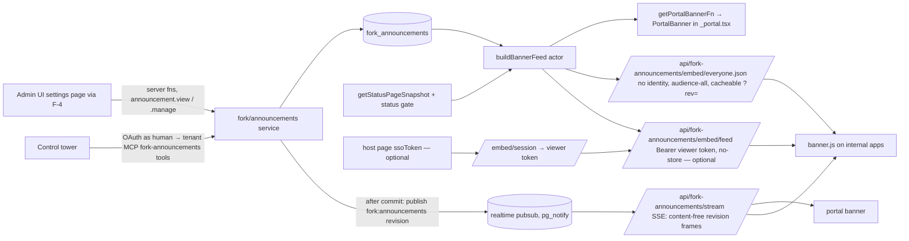

# Announcements Banner (Portal + Embeddable) — Design Plan v2

> **Status:** v2 (round 2 + staff review + intranet revision + second-pass review 2026-09-19) — supersedes `plans/v1/announcements-banner-widget-plan.md`. Planning only; nothing implemented.
> **Depends on:** Foundations (fork migration lineage, `fork_settings`, shared seams F-1..F-7, fork re-point
> registry — `02-fork-conventions.md` §3, §8, §10); `10-rbac-persona-extensions.md` Phase 1a (custom roles +
> permission keys enforced on MCP; "Fleet Agent" template holding `announcement.view` + `announcement.manage`, "Fleet
> Observer" template holding `announcement.view`) for Phase 4; `20-control-tower.md` (tower app +
> per-admin OAuth → tenant MCP) for Phase 4.
> **Decisions applied:** D1, D2, D-C1/D-C2 (tower acts through tenant MCP as the human; dual audit), D-N1
> (no localised content; English-only labels), D-N2 (browser-only dismissal), D-N3 (status fold-in), D-N4
> (plain text + per-type style presets + saved text templates), D-N6 (instant push via `lib/server/realtime/*`),
> D-N7 🟡 (re-worded for the intranet, §10), D-N8 (Fleet owners **and** Fleet Agents publish), D-N9 (every banner
> dismissible), D-X1 (app branding; narrowed in the embed by X-4 🟡), **D-E1…D-E6** (intranet-only, every user an
> SSO-authenticated employee, no internet egress, portals public + anonymous off + SSO-only — **D-E3 supersedes
> D-N5**).
> **Goal:** Time-sensitive, typed alerts ("we're aware of an issue", maintenance notices) shown in the portal and
> as an embeddable banner on internal (intranet) apps, authored per workspace in admin and centrally from the
> control tower, pushed to open viewers instantly.

## Round-2 changes

| Change | Driver |
| --- | --- |
| `severity` column → `kind` (`info`, `warning`, `critical`, `maintenance`, `success`) with **fixed presets** (colour tokens, icon, layout, dismiss/aria defaults) in code; authors only pick a kind and type text (+ optional link). No custom colours. | D-N4 |
| Saved **text templates** (`fork_settings` key `announcement_templates`) with `{placeholder}` substitution done **in the editor at authoring time**; stored announcements are plain text only. | D-N4 |
| Embed/portal chrome strings are English literals in `components/fork/**`; **locale seam dropped** (9 files), open item N-1 removed, no `init({ labels })`. | D-N1 |
| **Anonymous audience removed.** `audience.tier ∈ authenticated \| segments`; feed fails closed for non-`user` actors. The anonymous, edge-cached `active.json` is **removed**. Embed exchanges the host's signed widget identity JWT (`ssoToken`) for a short-lived viewer token and reads an authenticated, `no-store` feed. N-3 and N-6 closed. **Partly reversed by the intranet revision** (D-E3): a cached, identity-free feed serves audience-all items; identity is needed only for segment items. | D-N5 (superseded) |
| Embed viewer resolves to the same principal, segment memberships and portal-access decision as the portal; banner refetches when the widget emits `identify`. (Intranet revision: portal-access replication dropped; identity optional, for segment items only.) | D-N7 🟡 |
| **Instant push:** writes publish a content-free `revision` event on logical channel `fork:announcements` via upstream `pubsub.publish`; portal and embed hold an SSE stream (new fork route reusing `subscribe`, `createSseStream`, `startStreamHeartbeat`, `createStreamLimiter`, HMAC stream-token pattern) and refetch on change. 30 s TTL / SWR design removed (N-5 closed). Scheduled go-live/expiry handled by a client timer at `nextTransitionAt` (still no jobs). | D-N6 |
| New seam: module-state ledger entry for a **dedicated** banner stream limiter (embeds on busy internal apps must not exhaust the chat stream budget). | D-N6 + module-state rule |
| `announcement.manage` granted to Manager (system) and the **"Fleet Agent"** custom-role template; Admin (fleet owner) holds it by construction. N-8 closed. | D-N8 |
| MCP registration, settings nav, Labs entry, catalogue edit now satisfied by shared seams F-3/F-4/F-6/F-7 — not counted. Tenant audit seam kept (N-9 → decided) and moved to Phase 1 so admin writes are audited from day one. | `02-…` §10, D-C2 |
| `created_by/updated_by_principal_id` declared as **exemptions** (staff-only) in the fork re-point registry (via F-5). | `02-…` §8 |

## Staff-review changes

| Finding ID | Change | Where in plan |
| --- | --- | --- |
| N1 | Viewer tokens are minted **only for a known principal** (never `principalId: null`); an identity not yet known to Quackback gets `{ status: 'unknown' }` and the banner **shows nothing** (no user creation). The banner re-exchanges on widget `identify` (user created/changed), on its own `identify`, and on viewer-token expiry or a `reidentify` 401 via a new host callback `init({ getIdentityToken: async () => jwt })` (5-min host JWT, `identity-token.ts:3`). Logout / account switch clears items, drops tokens and closes the stream before anything else renders. Feed re-resolves principal + memberships on every call and rejects a token whose principal was deleted or whose `externalId`/email now resolves to another principal. Stream tokens are bound to the viewer token and never outlive it. | §4.7 (Identity lifecycle), §9, §8 Phase 3 |
| N2 | Resolved-incident banners read a fork query by **`resolved_at`** (not `activeIncidents`, which excludes resolved at `status.public.ts:182-192`, nor `recentIncidents`, windowed by `startedAt` at `:217-224`), projected through the exported, audience-filtered `getPublicStatusIncident(actor, id)` (`:293`). `nextTransitionAt` includes status-derived transitions (success expiry at `resolvedAt + 1 h`, maintenance entering the lead window). Incident freshness stated: ≤ 5 min worst case, no upstream hook 🟡. | §4.3, §4.5, §9, §10 NQ-10 |
| N3 | Every announcement, config and template write commits the row/settings change **and** its audit row in one transaction via `recordAuditEventInTransaction(tx, …)` (`audit/log.ts:260`; `recordAuditEvent` at `:223` swallows errors). Revision is published only after commit. Tower distinguishes *uncertain* (timeout / transport error) from *confirmed failure* and reconciles by `broadcastId` (idempotent upsert via `fork_announcements_broadcast_uq`; replay returns the existing row with `created: false` and writes no second audit row). A `tower_audit` row never substitutes for a missing tenant row. Two more audit members (`config_updated`, `templates_updated`) under F-9. | §4.9, §4.10, §9 |
| X-4 | Embed branding narrowed explicitly: generated theme variables (re-scoped to `:host`) **+ branding font** (self-hosted woff2 served by a fork CORS route, registered with the `FontFace` API at document level under a namespaced family). **`customCss` is not applied in the embed** (portal/hub only), so per-app `customCss` overrides of kind colours do not reach the embed 🟡. | §4.2 Branding, §4.7, §10 NQ-13 |
| Observer read | New key **`announcement.view`** (`status_page`; Manager ✓, Contributor ✓, Fleet Observer ✓, Fleet Agent ✓) gates `list_announcements`, `list_announcement_templates` and admin read fns; `announcement.manage` still required for upsert/archive/delete-draft/config/templates-write. Read tools use `read:feedback` = `scopeForPermission('announcement.view')` (`api-key-scopes.ts:226,234,247`). | §4.9, §4.10, §6, §9 |
| X-6 | Seam IDs aligned with `SEAMS.md` (N-1, N-3, N-5; audit union is shared F-9, not a plan seam). Notes asking other plans to change removed from §6/§11. | §7, §6, §11 |
| X-7 | Phase 5 and the in-widget strip (NQ-7) labelled as deferred and **not** delivering notifications / an in-widget surface. | §8, §10 |

The N1 lifecycle above still applies, but only to the **optional** identified path after the intranet revision
(below): an unknown or cleared identity now falls back to the audience-all feed instead of showing nothing, and
stream tokens are gone.

## Intranet changes (D-E1…D-E6)

| Change | Decision | Where |
| --- | --- | --- |
| Embeds run on **internal apps**, not customer sites; every host-page user is an SSO-authenticated employee (edge SSO proxy + Quackback SSO). All "customer site / external site / customer backend" wording removed. | D-E1, D-E4 | header, §2, §4.2, §4.7 |
| **Embed identity model re-decided.** (a) Audience-**all** items ("Everyone") are served to any request that reaches the embed feed, via a simple, cacheable, identity-free `GET /api/fork-announcements/embed/everyone.json` (no preflight, `Access-Control-Allow-Origin: *`, `publicWorkspaceCacheHeaders`, cache-busted by `?rev=`) — network + edge SSO already restrict reach. (b) **Segment-targeted** items still require identity: the staff-review `ssoToken` → viewer-token exchange is kept but **optional**. 🟡 NQ-14 (confirm with owner). | D-E3 (supersedes D-N5), D-N7 🟡 | §4.4, §4.7, §10 |
| N1 flows simplified: "show nothing to unknown identities" is **no longer the default** for audience-all items. Unknown identity, no identity, logout, account switch, `reidentify` and viewer-token expiry without `getIdentityToken` all **fall back to the everyone feed** (only segment items disappear). | D-E3, D-N7 🟡 | §4.7 identity lifecycle, §9 |
| **Stream tokens removed.** The SSE stream carries only content-free `revision` frames, so it no longer authenticates embed callers (it must serve identity-free embeds anyway); the portal still uses its session. Dedicated limiter (N-5) kept and is now the stream's only guard. | D-E1, D-N6 | §4.6, §4.7 |
| **Private-portal checks removed where moot:** embed no longer replicates `resolvePortalAccessForRequest`'s invite / allowed-segment / widget-marker composition through `evaluatePortalAccess` (public portal ⇒ `granted: 'public'`, `domains/settings/portal-access.ts:149-153`). Replaced by a one-line guard: embed is served only when portal visibility is `public` (`getPortalConfig()`, `settings.service.ts:619`; default read as in `functions/portal-access.ts:197`); otherwise embed is off. **Kept:** the portal banner's `resolvePortalAccessForRequest()` call (harmless on a public portal) and the fail-closed non-user rule for the portal actor. NQ-12 closed. | D-E3 | §4.4, §4.7, §4.8 |
| **Fonts:** the embed uses the **same bundled `@fontsource` woff2 files** upstream already self-hosts (`globals.css:17` Inter; per-family `styles/fonts/*.css` loaded by `lib/shared/theme/font-loader.ts:20`), served from the instance by the fork font route. No remote font loads, no CDN. | D-E2 | §4.2 |
| **Realtime stays on the intranet:** push is upstream `pg_notify` pub/sub + SSE from the Quackback instance to intranet browsers; no external push service, no internet egress from any component. | D-E2 | §4.6 |
| New open item: the **edge SSO proxy** must let cross-origin, credential-less requests from other intranet apps reach the six embed paths (`banner.js`, `everyone.json`, `stream`, font, and the optional `embed/session` + `embed/feed`), or share its cookie domain with host apps. 🟡 NQ-15. | D-E1 | §4.7, §10 |
| Seams: **none removed, none added** (N-1, N-3, N-5 all still needed). Fork-only removals: stream-token module usage, the `PortalAccessContext` replication in `embed-viewer.ts` and its contract-test coverage. | — | §7 |

## Second-pass review changes

Source: `REVIEW-2026-09-19-SECOND-PASS.md` R2-8. Body sections below are rewritten to match; superseded text removed.

| Finding | Change | Where |
| --- | --- | --- |
| **R2-8** (P2): the SSE stream reads the revision before it subscribes | **Subscribe first, then read and send the current revision** (the reviewer's first option; "re-read after subscribing" is not needed as well). The stream `await`s `subscribe(['fork:announcements'], …)`, which resolves only after the listener's `LISTEN` is registered (`sql.listen`, `realtime/pg-listener.ts:94`, awaited through `acquireConnection`, `realtime/pubsub.ts:265`) and the handler is in the registry (`pubsub.ts:277`). Only **then** does it read the revision from the DB and send it. A write that commits before the read is covered by the read. A write that commits after it publishes after `LISTEN` is active, so it is delivered live. There is no gap. **Ordering / no regression:** the content hash is replaced by a **monotonically increasing revision number**, a per-workspace counter row bumped **inside each write transaction**. The row lock makes commit order equal revision order. Frames carry `{ epoch, rev }`. The server sends a frame only when `rev` > the last one it sent on that connection, and the client **ignores any frame with `rev` ≤ the last applied revision**. So an initial frame that loses a race with a live event cannot regress the view, and neither can an out-of-order notify or a slow feed response (feed responses older than the last applied revision are discarded). The feed reads the counter **before** its items, so a response is never labelled newer than its content. **Recovery kept, bound stated separately:** publish is still fire-and-forget (`pubsub.ts:306`), and a notify can be lost (publish failure, `LISTEN` reconnect). The visible-tab periodic refetch (every 5 min) is the recovery path: a committed change whose event is lost reaches an open, connected viewer within **5 min + ≤ 2 s jitter**, and immediately on focus or reconnect. Normal delivery stays **< 2 s**. **Acceptance:** with an injected stream hook, publish (commit + notify) (a) just before `subscribe` is called — the old read-then-subscribe gap, (b) after `subscribe` resolves but before the initial read, and (c) after the initial read but before the initial frame is sent. In each case the open **portal** tab and the **embed** show the new content with the `EventSource` opened once (no reconnect), the 5-minute refetch and the 60 s fallback poll not fired (fake timers), within 2 s. Plus: frames delivered out of order (7 then 6) → 6 ignored; a feed response with a lower revision than the last applied → discarded. | §3, §4.4, §4.6, §4.7, §4.9, §5, §8 Phase 2/3, §9 |
| Seams | **None added or removed.** The counter is a fork table in the fork lineage; the stream hook is a dependency-injection parameter of the fork route's handler (no module state, no ledger entry). | §5, §7 |

## 1. Changes from v1

| v1 issue (review §3.2 + coordinator findings) | v2 resolution |
| --- | --- |
| Over-built lifecycle: `scheduled`/`expired` states, publish/expire jobs, sweep, deadline provider | **Visibility derived from time at read**: `status = 'published' AND publish_at <= now AND (expires_at IS NULL OR expires_at > now)` — changelog precedent (`changelog.public.ts:39`, `changelog.query.ts:56`). States `draft \| published \| archived` only. No jobs, no sweep, no `hook-job.ts` case, no `startup.ts` arming. Viewers learn about time transitions from `nextTransitionAt` (§4.3). |
| v1 planned a new `earliestWorkspaceDeadline` provider | Not needed: nothing is scheduled server-side. |
| `notified_at` claim column | Dropped from Phases 1–4; optional Phase 5 registers a claim in `packages/db/src/side-effect-ledger.ts`. |
| Cached public `active.json` with `widgetCorsHeaders()` / `publicWorkspaceCacheHeaders` | Removed in round 2 (D-N5), **re-introduced narrowly by the intranet revision (D-E3)**: `embed/everyone.json` carries only audience-all, embed-surface items, is cacheable with `Vary: Host`, and is cache-busted by the pushed `revision` (`?rev=`), so freshness still comes from push, not TTL. The identified feed stays `no-store`. |
| "Sanitize rich body with `sanitize-tiptap`" | **Plain text + optional link** (D-N4). Clients insert text nodes only. |
| No portal-access / audience enforcement | Portal: `resolvePortalAccessForRequest()` (`functions/portal-access.ts:63`; always `granted` on the D-E3 public portal, kept as a harmless guard). Embed: served only when portal visibility is `public` (D-E3 baseline); no private-portal composition (§4.7). Audience via `tierAllows` (`policy/access.ts:19`). |
| Prelude reused `window.__QUACKBACK_URL__` / `__QUACKBACK_CONFIG__` | Banner prelude sets `window.__QUACKBACK_BANNER__ = { url, config }`; IIFE global `QuackbackBanner`. |
| Widget bundle budget ignored | Portal banner component is lean; `bun run check:widget-bundle` is a Phase 2 gate. |
| No locale strings | Superseded by D-N1: English-only chrome, no locale files touched. |
| No permission key | `announcement.view` + `announcement.manage` (category `status_page`) — §6. |
| `announcement_dismissals` table | Dropped (D-N2): `localStorage` keyed by id + `updatedAt`. |
| `settings.announcements_config` column | `fork_settings` keys `announcements`, `announcement_templates`. |
| TypeID PK, schema in upstream dir | `fork_announcements`, `uuid` PK, `packages/db/src/fork/schema/announcements.ts`, fork lineage. |
| Tower writes via `withWorkspaceScopeById` | Moot (D-C1/D-C2): tower calls fork MCP tools with the admin's OAuth token. |
| "Reuses `publish-widget.yml`" | New IIFE entry in `packages/widget/tsup.config.ts`, built by `apps/web/Dockerfile:41`; served by the app, no npm publish. |
| CSP unstated | §4.7. |
| Status fold-in coupled to raw tables | Only via `getStatusPageSnapshot()` (`domains/status/status.public.ts:123`) + exported gate helpers. |
| Widget identity reuse for embeds | **Designed (D-N7), §4.7** — was open item N-6; optional after the intranet revision (segment items only). |

## 2. Requirements

| #   | Requirement |
| --- | --- |
| R1  | Publish time-sensitive alerts of a fixed **kind** (info, warning, critical, maintenance, success) with optional link, schedule and expiry; styling comes from the kind's preset only. |
| R2  | Render in the **portal** (above `<main>`) and as an **embeddable banner** on internal (intranet) apps: audience-all items for every employee without identification; segment-targeted items only when the host identifies the viewer. |
| R3  | App-specific: rows live in the workspace's own DB; every read resolves the workspace per `Host`. |
| R4  | Central management from the control tower (single app or broadcast), attributable to the human (D-C2); Fleet owners and Fleet Agents may publish (D-N8). |
| R5  | Time-based visibility without jobs; client-side dismissal; audience = everyone (all employees) or segments. |
| R6  | Live status incidents / maintenance appear in the same strip (D-N3). |
| R7  | Publish/update/archive reach open portals and embeds instantly (D-N6). |
| R8  | Saved text templates for common notices; placeholders filled at authoring time. |
| R9  | Fork-safe: fork dirs, fork lineage, minimal seams; pass module-state / authz / host-vary / bundle guardrails. |
| R10 | No internet egress (D-E2): fonts, scripts and realtime are served from the instance; nothing is loaded from a CDN or third party. |

## 3. Architecture overview



Everything runs inside the intranet (D-E1/D-E2): the browsers, the internal host apps and the Quackback instance.
No component calls the internet.

One feed builder (`buildBannerFeed(actor, surface)`) serves both surfaces so they never diverge. The stream
carries **no content** — only a monotonically increasing revision number (`{ epoch, rev }`, §4.6) — so audience
filtering stays in the feed read.

## 4. Design

### 4.1 Fork code layout

| Kind | Path |
| --- | --- |
| Schema | `packages/db/src/fork/schema/announcements.ts` (barrel `packages/db/src/fork/index.ts`) |
| Migration | `packages/db/drizzle-fork/NNNN_fork_announcements.sql` |
| Domain | `apps/web/src/lib/server/fork/announcements/{announcements.service.ts, feed.ts, status-feed.ts, config.ts, templates.ts, revision.ts, embed-viewer.ts, viewer-token.ts, stream-limit.ts, embed-theme.ts, embed-fonts.ts}` (no stream-token module — removed by the intranet revision) |
| Server fns | `apps/web/src/lib/server/fork/announcements/functions.ts` |
| MCP tools | `apps/web/src/lib/server/mcp/tools/fork-announcements.ts`, listed in `mcp/tools/fork-index.ts` (F-3) |
| Shared | `apps/web/src/lib/shared/fork/announcements/{types.ts, schema.ts (zod), visibility.ts, presets.ts, placeholders.ts}` |
| Components | `apps/web/src/components/fork/announcements/{portal-banner.tsx, banner-bar.tsx, editor-form.tsx, template-picker.tsx, preview.tsx, use-banner-stream.ts}` |
| Settings registration | `components/fork/settings/fork-settings-modules.ts` (F-4); Labs `fork-announcements` in `lib/shared/fork/labs.ts` (F-6) |
| Routes | `routes/admin/settings.fork-announcements.tsx` (+ `.templates.tsx`, `.install.tsx`); `routes/api/fork-announcements/{stream.ts, banner[.]js.ts, embed/everyone[.]json.ts, embed/session.ts, embed/feed.ts, embed/font.$fontId.$weight[.]woff2.ts}` |
| Embed SDK | `packages/widget/src/fork/banner/{banner-queue.ts, render.ts, dismiss.ts, styles.ts, stream.ts, presets.ts}` |

Module state: all fork server code is request-scoped except **one** deliberate instance — the dedicated
stream limiter in `stream-limit.ts` (§4.6, seam N-5). `embed-fonts.ts` is a lazily imported constant map from
allow-listed `(fontId, weight)` to the bundled `@fontsource` woff2 file (no mutable state). No feed caches, no revision memo, no compressed-bundle
`Map` (`banner[.]js.ts` compresses per request, unlike `sdk[.]js.ts:17`). `packages/widget` is outside the
module-state roots.

### 4.2 Content model, presets and templates (D-N4)

- Fields: `kind` (required), `title` (≤ 140, required), `body` (plain text ≤ 500, optional),
  `link_url` (http/https via `sanitizeUrl`, `lib/shared/utils/sanitize`) + `link_label`. Clients render with
  `textContent` / React text nodes only — no HTML anywhere.
- **Presets** (`lib/shared/fork/announcements/presets.ts`, mirrored byte-for-byte in
  `packages/widget/src/fork/banner/presets.ts`; a unit test asserts equality): one entry per kind —

  | Kind | Colour token | Icon (inline SVG) | Defaults |
  | --- | --- | --- | --- |
  | `info` | `--fork-info` (blue) | info-circle | dismissible, `aria-live=polite` |
  | `warning` | `--fork-warning` (amber) | exclamation-triangle | dismissible, polite |
  | `critical` (incident) | `--destructive` (red) | x-octagon | dismissible, `role=alert` |
  | `maintenance` | `--fork-maintenance` (violet) | wrench | time window from `publishAt`/`expiresAt` appended to the text; dismissible, polite |
  | `success` (resolved) | `--success` (green) | check-circle | dismissible, polite; `expires_at` defaulted to +24 h in the editor |

  **One component, one layout for every kind** (mockup: https://claude.ai/artifact/XAn1u4GewieesuMGHsua43, board
  "Announcements — standard banner types"): icon · bold type title · text · optional link · dismiss. **Every banner of every
  kind is dismissible by the user** (D-N9); there is no author-side "not dismissible" option. Same height, padding, type sizes, link and dismiss styling across
  kinds; the kind changes only the colour token and icon. Background = 10 % tint of the kind colour over
  `--background` (16 % in dark mode), border = 35 % (40 % dark), title/link = kind colour mixed toward
  `--foreground` for contrast. Placement variants only: full-width strip in the portal/hub; rounded floating bar
  (with `--radius` and shadow) in the embed.
  Authors cannot change colours, icons, layout or dismissibility.
- **Branding (D-X1, conventions §11).** Kind colours are **semantic and consistent across apps** (info is always
  blue, incident always red) so users read them the same way everywhere; they are fork tokens with light and dark
  values, overridable per app via `customCss` **in the portal/hub only**. Everything else — background, foreground,
  font, radius, dark mode — comes from the app's theme, and tints/borders are derived with `color-mix()` against the
  app's `--background`, so each app's branding restyles its banners automatically. The portal banner inherits the
  portal's injected theme, `customCss` and font loader (`routes/_portal.tsx:372`).
  **Embed (narrowed promise, X-4 🟡):** the embed applies exactly two things from the app's branding —
  1. **Theme variables:** `generateWorkspaceThemeCSS` output (`lib/shared/theme/generator.ts:505`) with its `:root` /
     `.dark` selectors rewritten server-side to `:host` / `:host(.qb-dark)`; the SDK toggles `qb-dark` from the app's
     theme mode (or host `prefers-color-scheme` when the app follows system). Delivered in the `everyone.json`
     and session payloads (identical for every viewer of the workspace).
  2. **Font (no remote loads, D-E2):** `resolveBrandingFontId(customCss, configFontSans)`
     (`lib/shared/theme/fonts.ts:57`) picks the id; the payload carries
     `font: { family: 'qb-brand-<id>', fallback, faces: [{ url, weight, style }] } | null` (`null` for
     `inter`/`system`/unknown → fallback stack). Faces are the **same bundled woff2 files** upstream already
     self-hosts for branding — Inter via `@fontsource-variable/inter` (`globals.css:17`), other families via the
     `@fontsource/*` imports in `styles/fonts/*.css` loaded by `loadBrandingFont` (`lib/shared/theme/font-loader.ts:20`)
     — latin 400 + 600 only. They are served **from the Quackback instance** by fork route
     `GET /api/fork-announcements/embed/font/$fontId/$weight.woff2` (`font/woff2`, `Access-Control-Allow-Origin: *`
     because `FontFace` loads are CORS-mode, `public, max-age=31536000, immutable`); `embed-fonts.ts` maps the
     allow-listed `(fontId, weight)` (ids from `BRANDING_FONTS`, `fonts.ts:14`) to the `@fontsource` file resolved
     at build time — no new font dependency, no CDN, nothing downloaded at runtime. The SDK registers them with
     `new FontFace(...)` + `document.fonts.add()` at **document level** (fonts declared inside a shadow root are
     not reliably usable) under the namespaced family, so it never overrides a same-named host font, then sets
     `--font-sans` inside the shadow root. Failure → fallback stack.
  **`customCss` is not applied in the embed**: arbitrary author CSS targets portal markup, and injecting it into
  another team's internal app (even into a shadow root) is unscoped risk. Consequence: per-app `customCss`
  overrides of the `--fork-*` kind tokens show in the portal but the embed uses the default kind colours.
  Sort rank: critical > maintenance (active) > warning > info > success.
- **Saved templates** (`fork_settings` key `announcement_templates`, zod-validated, ≤ 50 entries):
  `{ id: uuid, name, kind, title, body?, linkUrl?, linkLabel? }`. When the key is absent, three code-defined
  starters are offered ("Scheduled maintenance {date} {time}", "Investigating: {service}", "Resolved: {service}");
  saving an edit writes the key. Listed with `announcement.view`, edited on
  `settings.fork-announcements.templates.tsx` with `announcement.manage`.
- **Minimal templating** (`lib/shared/fork/announcements/placeholders.ts`, pure): placeholders are
  `{identifier}` (`/\{([a-zA-Z][a-zA-Z0-9_]{0,31})\}/g`) in `title`, `body`, `linkUrl`, `linkLabel`.
  Choosing a template in the editor lists its placeholders as inputs (names `date`/`time`/`start`/`end` get
  date/time pickers, formatted in the author's locale as plain text), substitutes on submit, and the stored
  announcement is **plain text with no template reference**. The editor blocks publish while `{…}` tokens that
  match a template placeholder remain; the server does **not** interpret braces (literal `{…}` text is legal),
  and renderers never substitute anything. Tower compose uses the same pure helper (templates read via the
  `list_announcement_templates` MCP tool).

### 4.3 Visibility (time-derived)

`lib/shared/fork/announcements/visibility.ts`:

```ts
isLive(a, now) = a.status === 'published' && a.publishAt <= now && (a.expiresAt === null || a.expiresAt > now)
```

- SQL form in the feed query; index `(status, publish_at, expires_at)`.
- "Publish now" = `status='published', publish_at=now()`; "Schedule" = future `publish_at`; "Expire now" =
  `expires_at=now()`; "Archive" = `status='archived'`. Admin list shows a derived label
  (Draft / Scheduled / Live / Expired / Archived) — never stored.
- **Time transitions without jobs:** the feed also returns `nextTransitionAt` = the earliest future instant
  among: `publish_at` of published rows on this surface whose audience the actor passes; `expires_at` of returned
  items; and, when status fold-in is on, each status-derived transition (§4.5) — a resolved incident's
  `resolvedAt + 1 h` (success item expiry) and an upcoming maintenance's `scheduledStartAt − statusLeadHours`
  (entering the lead window). Clients set one timer to refetch at that instant (+0–5 s jitter) and re-apply the `expiresAt` check on
  every render, so a scheduled item appears on time and an expired one disappears on time with no server event.

### 4.4 Feed builder and audience

`feed.ts` — `buildBannerFeed(viewer: BannerViewer, surface: 'portal' | 'embed')`, where
`BannerViewer = { kind: 'actor', actor: Actor, access: PortalAccessDecision } | { kind: 'everyone' }`:

- **`actor`** (portal session, or the optional identified embed viewer):
  1. If `!access.granted` → `[]`. Portal: the decision from `resolvePortalAccessForRequest()` (always `public`
     under D-E3; kept as a harmless guard). Identified embed: the caller passes `{ granted: true }` after the
     portal-visibility guard (§4.7).
  2. If `actor.principalType !== 'user'` and `!isTeamActor(actor)` → `[]` (fail closed; with anonymous off and
     SSO-only sign-in every portal actor is a `user`).
  3. Load live rows where `surfaces ? surface`, filter `tierAllows(actor, audience.tier, audience.segmentIds)`
     (`policy/access.ts:19`); `isTeamActor` short-circuits to all (team preview).
- **`everyone`** (identity-free embed, §4.7): load live rows where `surfaces ? 'embed'` **and**
  `audience->>'tier' = 'authenticated'` only — never segment rows. No `tierAllows` call (there is no actor); the
  request is treated as "some employee" because only employees can reach it (D-E1).
- Then, for both: if `announcements.foldInStatus`, append `status-feed.ts` items (the `everyone` viewer is
  projected with an anonymous actor — `principalId: null`, `principalType: 'anonymous'`, no segments — so it gets
  status items only when the status page audience is `public` and only unrestricted components; 🟡 NQ-14);
  sort (kind rank, `priority desc`, `publishAt desc`), cap 5; UI shows first + "N more".

`audience.tier ∈ 'authenticated' | 'segments'`, labelled "Everyone" / "Specific segments" in the editor
(on the intranet "everyone" = every SSO-authenticated employee; no anonymous tier exists).

`BannerItem`: `{ id, source: 'announcement' | 'status', kind, title, body, link: {url,label} | null,
priority, publishAt, expiresAt, updatedAt }`. Feed response:
`{ enabled, epoch, revision, nextTransitionAt, items }`. `revision` is the workspace's announcement revision
number (§4.6), read **before** the items so a response is never labelled newer than its content (a label that is
older than the content only costs one extra refetch).

### 4.5 Status fold-in (D-N3)

Unchanged from round 1 except mapping target and freshness:

- Gate from exported parts of the private `resolveStatusPageGate()` (`functions/status.ts:757-777`):
  `getStatusSettings()` (`domains/settings/settings.status.ts:41`), `isFeatureEnabled('statusPage')`
  (`settings.service.ts:1003`), `isStatusPagePublished()` (`lib/shared/status-settings.ts:53`),
  `isStatusAudienceGranted(actor, settings)` (`domains/status/status.audience.ts:15`).
- Data, two sources:
  1. **Active + upcoming:** `getStatusPageSnapshot(actor, settings)` (`status.public.ts:123`) →
     `activeIncidents` (unresolved incidents + in-progress/verifying maintenance, `:182-192`) and
     `upcomingMaintenance` (segment narrowing already applied for `actor`).
  2. **Recently resolved (N2):** the snapshot cannot supply these — `activeIncidents` excludes resolved rows and
     `recentIncidents` windows by `startedAt` (`:217-224`), so a long-running incident resolved minutes ago is
     missing. `status-feed.ts` runs a fork **id-only** read on upstream's `status_incidents`:
     `kind='incident' AND deleted_at IS NULL AND resolved_at >= now() − 1 h ORDER BY resolved_at DESC LIMIT 5`,
     then projects each id through the exported `getPublicStatusIncident(actor, id)` (`status.public.ts:293`),
     which applies the same component-segment audience filter (`toPublicIncident` → `canViewStatusComponent`,
     `policy/status.ts:19`) and returns `null` when nothing is visible. No upstream edit; the read and projection
     are pinned by the contract test.
- Mapping: `impact critical|major → critical`, `minor → warning`, `none → info`, `kind maintenance →
  maintenance`; resolved (source 2) → `success` with `expiresAt = resolvedAt + 1 h`; upcoming maintenance only
  when `scheduledStartAt − statusLeadHours ≤ now` (default 24). An incident in both sources is deduplicated
  (resolved wins). Link → `/status/<incidentId>` (absolute for the embed). Status items' dismissal key includes
  their latest update time.
- **Freshness (stated, 🟡 NQ-10):** status writes do not publish our revision event (that would need a handler in
  upstream `events/targets.ts` for `status.incident_*` / `status.maintenance_*` — a seam we avoid). Status items
  refresh on any revision event, window focus, `nextTransitionAt` (success expiry, lead-window entry), and a
  5-minute safety refetch while visible. **Worst case: a new, changed or resolved incident reaches an open
  banner up to 5 min late** (immediately on page load / focus). Time-derived status transitions are on time.
- Contract test `fork/announcements/__tests__/status-feed.contract.test.ts` pins the 6 gate/snapshot symbols,
  `getPublicStatusIncident`, the `status_incidents` columns read (`kind`, `deleted_at`, `resolved_at`) and
  `PublicStatusIncident` fields (`status.types.ts:316`). Do not import `components/portal/status/*`. The portal
  banner hides `source='status'` items on `/status*`.

### 4.6 Instant push (D-N6)

**Why a new fork stream route rather than reusing `/api/chat/stream`:** that route is gated on
`isConversationsEnabled()` (`routes/api/chat/stream.ts:134-142`), marks presence for every stream (`:289`),
and only accepts `scope`/`conversationId`/`ticketId`; adding an announcements branch would be a seam in a
high-churn upstream file and would count banner viewers as chat presence. No other portal- or widget-wide
stream exists (the only `subscribe` caller under `routes/` is `chat/stream.ts:300`). The fork route reuses
upstream's primitives unchanged.

- **Revision number (R2-8).** `fork_announcement_revision` (§5) is a single row per workspace database holding
  `revision bigint` and a random `epoch` (set when the row is created, so a restore or re-seed can be detected).
  Every write transaction (upsert, archive, draft delete, config or template change) runs `UPDATE
  fork_announcement_revision SET revision = revision + 1 WHERE singleton = 1 RETURNING epoch, revision`, in the same
  transaction as the data change and its audit row (§4.9). Concurrent writers serialize on that row lock, so **commit
  order equals revision order**. A sequence would not give this: it hands out numbers in call order, not commit order,
  and a client would then skip a change that committed later with a lower number. No-op writes do not bump. There is no
  module memo.
- **Publish** (`revision.ts`): after the transaction commits, the service calls `publish(ANNOUNCEMENTS_CHANNEL,
  { epoch, rev })` (`realtime/pubsub.ts:306`, fire-and-forget) with `ANNOUNCEMENTS_CHANNEL = 'fork:announcements'` and
  the `revision` the transaction returned. The payload is tiny and content-free, well under the 7,800-byte inline
  limit (`pubsub.ts:62`). It is called inside the request's workspace scope (admin server fn or MCP request), which
  `publishAsync` requires (`currentWorkspaceNamespace()`, `pubsub.ts:312`). Publishes from different requests may
  arrive out of order; the ordering rule below makes that harmless.
- **Stream** `routes/api/fork-announcements/stream.ts` (GET, SSE), mirroring `chat/stream.ts`:
  1. **No viewer authentication** (intranet revision): frames carry only `{ epoch, rev }`, never announcement
     content, and identity-free embeds (§4.7) must be able to subscribe, so the stream token of the staff-review
     design is dropped. Reach is restricted by the network and edge SSO (D-E1); abuse is bounded by the
     dedicated limiter (step 2) and per-IP cap. Labs/`enabled` off → 404.
  2. Reserve a slot on the **dedicated** `announcementStreamLimiter` (`createStreamLimiter` from
     `realtime/stream-connection-limit.ts:77`; e.g. `maxGlobal 300, maxPerWorkspace 200, maxPerIp 20`). Refused →
     503; the client falls back to a 60 s poll of the feed.
  3. `createSseStream` (`lib/server/utils/sse.ts:35`), `retry: 5000`.
  4. **Subscribe first (R2-8).** `await subscribe(['fork:announcements'], handler)` (`pubsub.ts:256`). It resolves only
     after the workspace's listener has executed `LISTEN` (`await sql.listen`, `realtime/pg-listener.ts:94`, reached
     through `acquireConnection`, `pubsub.ts:265`) and the handler is in the registry (`pubsub.ts:277`). The handler
     forwards a payload as `event: revision` only if its `rev` is greater than `lastSent`, a local variable of this
     connection (not module state), or if its `epoch` differs.
  5. **Then read and send the current revision.** Read `{ epoch, revision }` from `fork_announcement_revision` and send it
     as the initial `revision` frame under the same `lastSent` rule. A write that committed before this read is covered
     by it. A write that commits after it publishes after `LISTEN` is active, so it is delivered live. A live frame
     that arrives before the initial one simply raises `lastSent`, and the older initial frame is then not sent.
     Reconnecting clients catch any event they missed while disconnected through this frame.
  6. `startStreamHeartbeat` (`realtime/stream-heartbeat.ts:40`) reaps abandoned tabs; teardown releases the
     slot and unsubscribes, re-entering the captured workspace scope exactly as `chat/stream.ts:252-281`. If the
     client aborted while `subscribe` was in flight, cleanup unsubscribes as `chat/stream.ts:316` does.
  7. Headers: `SSE_RESPONSE_HEADERS` + `Access-Control-Allow-Origin: *` (no credentials, so a plain
     cross-origin `EventSource` from an internal app works without preflight; the portal's same-origin
     `EventSource` is unaffected).
  8. **Test hooks.** The route handler is a thin wrapper over `openAnnouncementStream(request, deps)`. Tests pass
     `deps.hooks.{beforeSubscribe, afterSubscribe, afterInitialRead}` (async callbacks) to inject a publish at each gap.
     Production passes none. This is parameter injection, with no module-level state.
- **Intranet only (D-E2):** push is upstream `pg_notify` pub/sub inside the deployment plus SSE from the
  Quackback instance to intranet browsers. No external push/WebSocket service, no internet egress.
- **Client** (`use-banner-stream.ts` for the portal; `packages/widget/src/fork/banner/stream.ts` for the
  embed): opens the stream only while `document.visibilityState === 'visible'`, closes it when hidden and
  refetches on return. **Ordering rule (no regression):** the client keeps `lastApplied = { epoch, revision }` of the
  feed it last rendered.
  - A frame with the same `epoch` and `rev ≤ lastApplied.revision` is **ignored**.
  - Otherwise (a newer `rev`, or a different `epoch`) it refetches after 0–2 s random jitter, because broadcast fan-out
    would otherwise stampede the tenant DB.
  - A feed response is applied only if its `revision ≥ lastApplied.revision` (or its `epoch` differs). An equal revision
    is applied, so status and timer refetches still refresh. A slower, older response that arrives later is discarded.
  - Because the feed reads the counter before its items (§4.4), the applied revision never overstates the content.

  The embed refetches `everyone.json?rev=<rev>` and, when identified, the identified feed (which re-validates the viewer,
  §4.7). Identity changes never touch the stream: it is shared by the identified and identity-free paths.
- **Recovery and freshness bounds (stated separately, R2-8).**
  - **Normal path:** a committed announcement change reaches every open, connected portal tab and embed in **< 2 s**
    (notify + ≤ 2 s jitter + feed read), with no gap at stream start.
  - **Recovery path:** publish is fire-and-forget, and a notify can also be lost while the listener reconnects. The
    periodic refetch that runs every **5 minutes** while the tab is visible (the same timer as the status fold-in, §4.5)
    is the recovery path. A change whose event was lost reaches an open viewer within **5 min + ≤ 2 s**, and at once on
    window focus, tab show or stream reconnect (the initial frame).
  - **Limiter refusal:** the 60 s feed poll gives a 60 s + jitter bound.
  - Status incidents keep their own 5-minute bound (NQ-10).
- **Pooled tenancy:**
  - Isolation is upstream's: the logical channel rides inside the per-workspace envelope; the registry is keyed
    by `(namespace, channel)` and `dispatch` refuses envelopes naming another workspace (`pubsub.ts:121-150`).
    No workspace id in the channel name is needed.
  - One refcounted session-mode LISTEN connection per workspace per replica (`pubsub.ts:194-245`), shared with
    chat. It **pins the tenant's compute while any viewer is connected** (`chat/stream.ts:411-414`); closing
    streams on hidden tabs and heartbeat reaping bound this, but a workspace with an embed on a busy internal app
    will effectively stay warm. Accepted consequence of D-N6.
  - The stream resolves its workspace from `Host` like every request; with no token there is nothing to
    cross-verify. Viewer-token signing (§4.7) uses `activeSecretKey()` (`lib/server/secret-key.ts:37`), per
    workspace under pooling, so a viewer token minted under workspace A fails verification under B.
  - Why a dedicated limiter: the shared `streamLimiter` (`stream-connection-limit.ts:151`) allows 100 streams
    per workspace; embed viewers on busy internal apps would exhaust it and refuse agents' inbox and visitors'
    chat streams. The dedicated instance is module-level state by necessity (a process-local concurrency
    gauge, same category `workspace-keyed` as `ledger.ts:196-205`) → ledger seam N-5 + `MODULE-STATE.md`
    regeneration. Global FD headroom: 500 (chat) + 300 (banner) per process — to be confirmed in load test (NQ-11).

### 4.7 Embeddable banner on internal apps (Phase 3) — everyone by default, identity for segments (D-E3, D-N7 🟡)

**Model (intranet revision, 🟡 NQ-14).** Embeds run on internal apps. Every host-page user is an SSO-authenticated
employee (D-E1), but the banner SDK cannot know *who* without an identity token. So:

- **(a) Audience-all ("Everyone") items need no identity.** Any request that reaches the instance is from an
  employee (network + edge SSO restrict reach), so the banner fetches them from a simple, cacheable GET. This is
  the default path and works on any internal app, with or without the widget.
- **(b) Segment-targeted items need identity.** When the host supplies the widget's signed identity JWT, the
  banner exchanges it for a viewer token and reads the identified feed, which returns everything the portal shows
  that user (audience-all + their segments). Optional; hosts that never identify simply never see segment items.
- **Guard:** the embed serves anything only when `announcements.embedEnabled` and the portal's visibility is
  `public` (`getPortalConfig()`, `settings.service.ts:619`, read the way `functions/portal-access.ts:197` does,
  missing → `public`). If a deployment deviates from the D-E3 baseline and makes a portal private, the embed
  returns `{ enabled: false }` rather than re-implementing private-portal access off-portal. No invite /
  allowed-segment / widget-marker composition is replicated (removed; NQ-12 closed).

**Identity-free feed — `GET /api/fork-announcements/embed/everyone.json[?rev=<rev>]`:**
- No custom request headers → no CORS preflight. `enforcePerIpLimit` (`widget/public-endpoint.ts:45`,
  `keyPrefix 'fork-ann-everyone'`, 120/min). Embed or Labs off, or portal not `public` → `{ enabled:false }`.
- Body: `buildBannerFeed({ kind: 'everyone' }, 'embed')` → `{ enabled, revision, nextTransitionAt, items, theme,
  font }` (theme/font per §4.2; identical for every viewer).
- Headers: `Access-Control-Allow-Origin: *`, `Content-Type: application/json`,
  `...publicWorkspaceCacheHeaders(30)` (`workspaces/http-cache.ts:35`; precedent `routes/api/widget/config[.]json.ts:10`)
  so the host-vary guard stays green. The client always appends the latest `rev` from the stream (and, for a
  `nextTransitionAt` refetch, `&t=<nextTransitionAt>`), so a cached body is never older than the last known
  revision; the 30 s TTL only affects the very first load before the stream's initial frame.

**Identified path (optional) — identity.** The host page passes the **same** signed identity JWT it gives the
widget (HS256 over `settings.widget_secret`, `lib/server/widget/identity-token.ts:27,54`):
`QuackbackBanner('identify', { ssoToken })` or `init({ ssoToken })`. Reusing the widget's session is **not
feasible**: the host SDK forwards `identify` to the iframe over postMessage (`packages/widget/src/core/sdk.ts:83,211`)
and only receives the resulting user object (`:119-131`); the session token lives inside the iframe origin. The
banner subscribes to `window.Quackback('on', 'identify', …)` (`sdk.ts:379-380`) when the widget is present and
**re-exchanges** after it fires.

**Identity lifecycle (N1, simplified).** The viewer token always names a principal; it is never minted for an
identity Quackback does not know. Any state without a valid viewer token **falls back to the everyone feed** — it
never blanks the banner.

| Situation | Behaviour |
| --- | --- |
| No `ssoToken` ever supplied | Everyone feed only (default). |
| Identity known (user by `externalId`, then email, has a principal) | Session returns `{ status: 'ok', viewerToken, expiresAt }`; banner switches to the identified feed (audience-all + segments). |
| Identity not yet known (banner initialised before widget identify creates the user; banner-only host) | Session returns `{ status: 'unknown' }`, no token; banner **stays on the everyone feed**. The banner never creates users (that stays with widget identify, `routes/api/widget/identify.ts`). |
| Widget `identify` event with a `user` (created or changed) | Re-run the exchange with a fresh host JWT (next row); a first-visit user gains segment items as soon as widget identify has created them. |
| Host JWT needed (unknown → retry, viewer-token expiry, `401 reidentify`) | `ssoToken` from the last `identify`/`init` if its `exp` is > 30 s away; otherwise `await getIdentityToken()` — optional `init({ getIdentityToken: async () => jwt })` host callback (host JWT is normally 5 min, `widget/identity-token.ts:3`). No callback and no fresh JWT → drop the viewer token and fall back to the everyone feed until the next `identify`. |
| Logout / account switch: `QuackbackBanner('logout')`, widget `identify` with `user: null`, or a `user.email` differing (case-insensitive) from the viewer's | **Synchronously** remove segment-only items, drop the viewer token and cancel identity timers, render the everyone feed; for a switch, exchange for the new identity. Audience-all items may stay on screen (every employee sees them). Dismissal state is per browser (D-N2) and is not cleared. |
| Principal deleted, blocked, or `externalId`/email now resolving to a different principal | Feed returns `401 { error: 'reidentify' }`; banner falls back to the everyone feed and re-exchanges once (backoff 60 s on repeat). |

- **`POST /api/fork-announcements/embed/session`** `{ ssoToken }` (JSON → CORS preflight; `OPTIONS` via the
  existing `preflightResponse()`/`corsHeaders()` in `lib/server/integrations/apps/cors.ts:15-21`, precedent
  `routes/api/track.ts:17`):
  1. `enforcePerIpLimit` (`keyPrefix 'fork-ann-session'`, 30/min); embed or Labs off, or portal not `public` →
     `{ enabled:false }`.
  2. `getWidgetSecret()` (`settings.widget.ts:426`) + `verifyHS256JWT` (`identity-token.ts:54`); require
     `sub|id` and `email` — the same claims `/api/widget/identify` requires (`routes/api/widget/identify.ts:195-213`).
     Bad/expired JWT → 403 (banner stays on the everyone feed).
  3. `embed-viewer.ts` resolves the principal **read-only** (user by `externalId = sub`, then `lower(email)`;
     principal by `userId`) — no user creation, no segment reconcile, no session, no changelog auto-subscribe.
     Not found or blocked (`isBlocked`, `domains/principals/blocking.ts:39`) → `{ status: 'unknown' }` (no oracle).
  4. Returns `{ status: 'ok', viewerToken, expiresAt }`: fork HMAC token (`viewer-token.ts`, pattern of
     `realtime/stream-token.ts`, domain tag `fork-announcements-viewer:v1`, `activeSecretKey()`, TTL 12 h) over
     `{ principalId, email, externalId }` (`principalId` required). Held in memory only; a page load re-exchanges.
- **`GET /api/fork-announcements/embed/feed`** with `Authorization: Bearer <viewerToken>` (preflighted):
  re-validates on every call — principal still exists and is not blocked, and re-resolving the token's
  `externalId`/email still yields the same principal (else `401 reidentify`); embed enabled and portal `public` —
  then builds the actor — `principalType 'user'`, `role 'user'` (non-dashboard audiences are portal-tier, as
  `chat/stream.ts:125`), `segmentIds = segmentIdsForPrincipal(principalId)` (`segment-membership.service.ts:232`,
  read fresh per call) — and calls `buildBannerFeed({ kind: 'actor', actor, access: { granted: true } }, 'embed')`.
  Headers `corsHeaders()` (`no-store, private`). No stream token (the stream is identity-free, §4.6).
- **Bundle:** tsup IIFE entry `banner: 'packages/widget/src/fork/banner/banner-queue.ts'`,
  `globalName: 'QuackbackBanner'`, `dist/banner.js`, ≤ 10 KB gz (presets + SSE client), no deps; size test in
  `packages/widget/src/fork/banner/__tests__/size.test.ts`. Built by `Dockerfile:41` from the build network's
  package mirror (nothing fetched at runtime).
- **Serve** `routes/api/fork-announcements/banner[.]js.ts`: inlines `dist/banner.js?raw` with prelude
  `window.__QUACKBACK_BANNER__={url,config:{placement}}`; headers `Content-Type`, `Access-Control-Allow-Origin: *`,
  `...publicWorkspaceCacheHeaders(300, 'Accept-Encoding')`. Disabled → no-op script (mirrors `sdk[.]js.ts:74-79`).
  On load the banner fetches `everyone.json` and opens the stream; it calls `embed/session` only after an
  `ssoToken` is supplied.
- **Client:** shadow root on a host `<div>` at `body` start (or `container`); theme variables on `:host` and
  branding font per §4.2 (no `customCss`); presets per kind; `textContent` only; links `rel="noopener noreferrer"`,
  http(s) only; dismissal in host `localStorage` (`qb.banner.*`, try/catch); English chrome ("Dismiss",
  "View details", "N more"); stream per §4.6. All requests go to the instance URL from the prelude — nothing else.
- **Coexistence with the widget:** separate global, prelude key and storage keys; optional read-only use of
  `window.Quackback('on','identify')`.
- **Edge SSO (🟡 NQ-15):** requests are credential-less cross-origin (`fetch` without cookies, plain
  `EventSource`, `FontFace`), so the edge SSO proxy in front of the instance must let `banner.js`,
  `embed/everyone.json`, `embed/session`, `embed/feed`, `stream` and the font route through from intranet
  origins (network restriction only), or else host apps must share the proxy's cookie domain and the SDK switches
  to `credentials: 'include'` with an origin allow-list instead of `*`.
- **CSP (install page):** `script-src <instance>`; `connect-src <instance>` (fetch + `EventSource`); styles via
  constructable stylesheets (`adoptedStyleSheets`), fallback `<style>` in the shadow root needs
  `'unsafe-inline'` or `init({ nonce })` (the widget already injects a `<style>`, `packages/widget/src/core/style.ts:8-13`);
  `font-src <instance>` (branding font, §4.2); no `frame-src`, no `img-src` (inline SVG icons), no third-party
  origins.
- **Install page** `settings.fork-announcements.install.tsx`: minimal snippet (script tag only → everyone items);
  an optional "segment-targeted items" snippet showing `ssoToken` reuse from the widget identify call, a
  `getIdentityToken` callback hitting the host app's own JWT-minting endpoint, and `logout` on sign-out; CSP block;
  the edge-proxy note (NQ-15); and that `customCss` is not applied in the embed.

### 4.8 Portal banner (Phase 2)

- `getPortalBannerFn` (`createServerFn GET`): `getOptionalAuth()` + `policyActorFromAuth()`
  (`functions/auth-helpers.ts:240,341`) + `resolvePortalAccessForRequest()` →
  `buildBannerFeed({ kind: 'actor', actor, access: decision }, 'portal')`. Uses the **portal session** (Quackback
  SSO sign-in) as before; the access call is kept even though a D-E3 public portal always grants (harmless, and
  correct if a portal is ever made private). No `requireAuth` (non-user actors get `[]` inside), so it appears in
  `MATRIX.md` §4 "entry points without a gate"; no `classifications.ts` entry.
- `portal-banner.tsx` is self-fetching (`useQuery`, `staleTime: Infinity`, invalidated by the stream's
  `revision`, window focus, `nextTransitionAt` timer); the `_portal.tsx` seam is one JSX line + import between
  `<PortalHeader …/>` and `<main>` (`routes/_portal.tsx:381-390`).
- Renders only when Labs `fork-announcements` and `announcements.enabled`. Dismissal
  `localStorage['qb.banner.dismissed']` (id → `updatedAt`). Presets drive `role`/`aria-live`.
- English literals (D-N1); `components/fork/**` is outside `PORTAL_SOURCE_ROOTS`
  (`lib/shared/__tests__/portal-message-coverage.test.ts:19-25`), so no locale keys are needed.
- Imports allowed: React, `lib/shared/fork/announcements/*`, heroicons. Forbidden: Tiptap/editor,
  `components/portal/status/*`.

### 4.9 Admin authoring (Phase 1)

- Page registered through F-4 (`fork-settings-modules.ts` adds "Announcements" to the workspace module);
  visible with `announcement.view` (read-only list, preview and templates); editor, actions and config panel
  render only with `announcement.manage`; shows an "enable in Labs" notice when the experiment is off.
- List (derived-state chips), editor: **kind picker with live preset preview** (same `banner-bar.tsx`),
  "Start from template" (placeholder inputs, §4.2), title, body, link, priority, surfaces, audience (all /
  segments, reusing the existing segment list fn), publish-now / schedule / expire (no dismissibility control — every banner is dismissible, D-N9).
- Templates page; config panel (`enabled`, `embedEnabled`, `foldInStatus`, `statusLeadHours`, `placement: 'top'`).
- Server fns — reads `requireAuth({ permission: PERMISSIONS.ANNOUNCEMENT_VIEW })`: `listAnnouncementsFn`,
  `getAnnouncementFn`, `getAnnouncementsConfigFn`, `listAnnouncementTemplatesFn`; writes
  `requireAuth({ permission: PERMISSIONS.ANNOUNCEMENT_MANAGE })`: `upsertAnnouncementFn`, `archiveAnnouncementFn`,
  `deleteDraftAnnouncementFn`, `updateAnnouncementsConfigFn`, `saveAnnouncementTemplatesFn`. Service functions
  take the acting principal so admin and MCP share them.
- **Atomic audit (N3).** Every write runs as `db.transaction(async (tx) => { write; bump revision (§4.6); await
  recordAuditEventInTransaction(tx, …) })` (`audit/log.ts:260`) — the `fork_announcements` row or the
  `fork_settings` upsert **and** its `fork_announcement.*` audit row commit or roll back together; the
  best-effort `recordAuditEvent` (`:223`, logs and swallows insert errors) is not used. Only after commit does
  the service `publish()` the revision the transaction returned (fire-and-forget; a lost event is healed within the
  §4.6 recovery bound: the 5-minute visible-tab refetch, or at once on focus or reconnect). No-op writes (idempotent replay, unchanged content) write no audit row and publish nothing.
  Events: `fork_announcement.created|updated|archived|config_updated|templates_updated` (draft delete records
  `archived` with `metadata.deletedDraft`), actor = the human principal, `metadata.origin` incl. `broadcastId`.

### 4.10 Control-tower management (Phase 4, R4)

- `mcp/tools/fork-announcements.ts`, listed in `mcp/tools/fork-index.ts` (F-3), via `registerTool`
  (`mcp/tools/helpers.ts:177`): `list_announcements`, `upsert_announcement`, `archive_announcement`,
  `list_announcement_templates`. All `teamOnly: true`, each with an **in-handler** permission check via the MCP
  permission helper from `10-…` Phase 1a:

  | Tool | Permission | Scope (`scopeForPermission`, `api-key-scopes.ts:247`) |
  | --- | --- | --- |
  | `list_announcements` (filters: derived state, `broadcastId`) | `announcement.view` | `read:feedback` (verb `view` ∈ `READ_VERBS` :234; `status_page` :226) |
  | `list_announcement_templates` | `announcement.view` | `read:feedback` |
  | `upsert_announcement`, `archive_announcement` | `announcement.manage` | `write:feedback` |

- Who can read / publish (D-N8): fleet `owner` → tenant Admin (every key); fleet `agent` → "Fleet Agent" custom
  role (`view` + `manage`); fleet `observer` → "Fleet Observer" custom role (`view` only → list tools succeed,
  upsert/archive denied); Manager holds both.
- The tower calls with the admin's OAuth token (D-C2), so `created_by/updated_by_principal_id` name the human.
  `origin: { source: 'tower', broadcastId, towerActor }`; `towerActor` informational only; server forces
  `source='tower'` only for OAuth callers.
- **Broadcast:** fan-out of `upsert_announcement` with a shared `broadcastId`. The upsert is an `INSERT … ON
  CONFLICT` on `fork_announcements_broadcast_uq`: a replay with identical content returns the existing row with
  `{ created: false, changed: false }` and writes nothing (no audit, no revision); changed content is an update
  (audited). Each tenant write publishes its own revision event → instant on every tenant.
- **Tower outcome classes (N3):** per tenant the tower records `succeeded` (tool result), `failed` (confirmed:
  tool/permission/validation error returned by the tenant) or **`uncertain`** (timeout, connection reset, 5xx
  without a tool result — the tenant may have committed). Uncertain tenants are reconciled by
  `list_announcements({ broadcastId })` and, if absent, re-sending the same `upsert_announcement` (safe by the
  index); the per-tenant result shows "uncertain → reconciled/failed", never "failed" while uncertain.
- **Audit (D-C2 dual audit):** tenant rows per §4.9 (members under shared seam F-9); the tower additionally
  writes `tower_audit` per tenant with the outcome class. A `tower_audit` row never stands in for a tenant audit
  row: tenant audit exists iff the tenant write committed, by construction of the transaction.

## 5. Data model

`fork_announcements` (`packages/db/src/fork/schema/announcements.ts`, migration `NNNN_fork_announcements.sql`):

| Column | Type | Notes |
| --- | --- | --- |
| `id` | `uuid` PK `defaultRandom()` | |
| `kind` | `text not null` CHECK in (`info`,`warning`,`critical`,`maintenance`,`success`) | selects the preset; text+CHECK, not a PG enum |
| `title` | `text not null` | CHECK `char_length <= 140` |
| `body` | `text null` | plain text, CHECK `<= 500` |
| `link_url`, `link_label` | `text null` | http(s) validated in zod |
| `status` | `text not null default 'draft'` CHECK in (`draft`,`published`,`archived`) | |
| `publish_at` | `timestamptz not null default now()` | |
| `expires_at` | `timestamptz null` | CHECK `expires_at IS NULL OR expires_at > publish_at` |
| `priority` | `integer not null default 0` | |
| `surfaces` | `jsonb not null default '["portal"]'` | subset of `portal`,`embed` (`widget` reserved, NQ-7) |
| `audience` | `jsonb not null default '{"tier":"authenticated","segmentIds":[]}'` | `tier` ∈ authenticated/segments |
| `origin` | `jsonb not null default '{"source":"local"}'` | `{source:'local'\|'tower', broadcastId?, towerActor?}` |
| `created_by_principal_id`, `updated_by_principal_id` | `typeIdColumnNullable('principal')` FK `on delete set null` | staff-only → **exemption** in `fork/principals/fork-repoint.ts` (F-5) |
| `created_at`, `updated_at` | `timestamptz not null default now()` | informational (the revision is the counter below) |

Indexes: `fork_announcements_live_idx (status, publish_at, expires_at)`; `fork_announcements_broadcast_uq`
unique on `((origin->>'broadcastId'))` where `origin ? 'broadcastId'`. No `notified_at`, no dismissals table,
no templates table.

`fork_announcement_revision` (same schema file and migration; R2-8): `singleton smallint PK CHECK (singleton = 1)`,
`epoch uuid not null default gen_random_uuid()`, `revision bigint not null default 0`, `updated_at timestamptz not null
default now()`. The migration inserts the one row. It is bumped only inside announcement write transactions (§4.6,
§4.9) and never decreases. A restored or re-created row gets a new `epoch`, which clients treat as newer. It holds no
principal references.

`fork_settings` keys (zod, defaults on read):
- `announcements`: `{ enabled: false, embedEnabled: false, foldInStatus: true, statusLeadHours: 24, placement: 'top' }`.
- `announcement_templates`: `Array<{ id, name, kind, title, body?, linkUrl?, linkLabel? }>` (≤ 50); absent → code starters.

## 6. Permissions

| Key | Category | Owner/Admin | Manager | Contributor | Fleet Agent (template) | Fleet Observer (template) | Enforced at |
| --- | --- | --- | --- | --- | --- | --- | --- |
| `announcement.view` | `status_page` | yes | **yes** | **yes** (F-7 fenced Contributor list) | yes | **yes** | admin read fns; `list_announcements`, `list_announcement_templates` (scope `read:feedback` + in-handler) |
| `announcement.manage` | `status_page` | yes | **yes** (not in `WORKSPACE_ADMIN_PERMISSIONS`) | no | **yes** (D-N8) | no | admin write fns; `upsert_announcement`, `archive_announcement` (scope `write:feedback` + in-handler); config + template writes |

- Both added in the F-7 fenced blocks of `PERMISSIONS` / `PERMISSION_CATALOGUE` (`packages/db/src/rbac-catalogue.ts`;
  `status_page` category :167); `announcement.view` also in the fenced Contributor block. Manager = all minus
  `WORKSPACE_ADMIN_PERMISSIONS` (:613, filter :649) → both granted. The Fleet Agent / Fleet Observer templates
  are `10-…`'s (listed under *Depends on*). Invariant (unit test): every system role or template holding
  `announcement.manage` also holds `announcement.view`.
- Labs toggling stays with upstream's Labs permission.
- The embed endpoints are viewer reads (no permission key): `everyone.json` and `stream` are identity-free
  (audience-all / content-free; network + edge SSO restrict reach, D-E1); `embed/session` + `embed/feed` are
  gated by widget-JWT verification and the viewer token. All require `embedEnabled` and a `public` portal.
- After editing: `bun run db:permissions`; regenerate `MATRIX.md`.

## 7. Seams

Shared seams used, not counted: F-1 (fork migrations), F-2 (drift), F-3 (MCP tools), F-4 (settings page),
F-5 (re-point exemption), F-6 (Labs `fork-announcements`), F-7 (`announcement.view`, `announcement.manage`),
F-9 (`fork_announcement.*` audit members).

| ID | Upstream file | Change (one-liner) | Phase | Why unavoidable | How to re-apply |
| --- | --- | --- | --- | --- | --- |
| N-1 | `apps/web/src/routes/_portal.tsx` | import + `<ForkAnnouncementsBanner />` between `PortalHeader` and `<main>` | 2 | No slot in the portal layout | Re-insert directly after the `PortalHeader` element |
| N-3 | `packages/widget/tsup.config.ts` | `banner` IIFE entry | 3 | Only build that runs before the app build (`Dockerfile:41`) | Re-add the extra config object |
| N-5 | `apps/web/src/lib/server/policy/module-state/ledger.ts` | Entry for `announcementStreamLimiter` in `lib/server/fork/announcements/stream-limit.ts`, category `workspace-keyed` | 2 | Process-local concurrency gauge is module state by nature; sharing upstream's limiter would starve chat streams | Re-append entry; regenerate `MODULE-STATE.md` |

**Count: 3 plan seams (3 files)**, matching `SEAMS.md`. The `fork_announcement.*` audit members
(`created`, `updated`, `archived`, `config_updated`, `templates_updated`) ride shared seam **F-9**; both
permission keys ride **F-7**. Staff-review corrections add **no** seams: identity lifecycle is fork SDK +
fork routes; the resolved-at status read is a fork query + exported `getPublicStatusIncident` (pinned by
contract test, not an edit); transactional audit uses the existing `recordAuditEventInTransaction`; embed fonts
are a fork route. **Intranet revision: no seams removed, none added** — N-1 (portal mount), N-3 (banner build
entry) and N-5 (dedicated limiter; still needed because identity-free embed streams on busy internal apps would
exhaust chat's budget) all remain. The removals are fork-only: stream-token minting/verification, the
`PortalAccessContext` replication in `embed-viewer.ts` (and its contract-test coverage). The new
`everyone[.]json.ts` route uses the existing `publicWorkspaceCacheHeaders` helper, so the host-vary guard covers
it without an edit. **Second-pass (R2-8): no seams added or removed.** The subscribe-then-read order, the revision
counter table (fork lineage) and the injected stream test hooks are all fork code; `realtime/*` is used unchanged.
Generated (regenerate): `lib/shared/permissions.ts`, `MATRIX.md`, `MODULE-STATE.md`,
`GRAPH.md`. Not touched: `settings` schema, `classifications.ts`, `hook-job.ts`, `startup.ts`,
`jobs/deadlines.ts`, `routes/api/chat/stream.ts`, `realtime/*`, `events/targets.ts`, `domains/status/*`,
`packages/widget/src/core/*`, `packages/widget/package.json`, locale files.

## 8. Phases and validation gates

| Phase | Deliverable | Gate |
| --- | --- | --- |
| **1. Data + authoring** | Table + migration, service, `visibility.ts`, `presets.ts`, `placeholders.ts`, templates key + page, config, key via F-7, Labs via F-6, page via F-4, re-point exemption via F-5, audit members (F-9), transactional audit, both keys, revision counter (`fork_announcement_revision`, bumped in each write tx) + publish | Fork drift clean; `isLive` + placeholder unit tests; Manager and a Fleet-Agent-template role can author; Contributor reads the list but write fns 403; audit rows name the author; injected audit-insert failure rolls back the write and publishes nothing; `MATRIX.md` regenerated; module-state green |
| **2. Portal banner + push + status** | `feed.ts`, `status-feed.ts`, `getPortalBannerFn`, `portal-banner.tsx`, `_portal.tsx` mount, `stream.ts` route, dedicated limiter (N-5), resolved-at status read | `check:widget-bundle` passes; non-user actor → nothing; segment row only to members; publish in admin appears in an open portal tab < 2 s without reload; **R2-8 gap test green** (publish injected before `subscribe`, between `subscribe` and the initial read, and between the read and the initial frame → the open portal tab shows the new content without reconnect or poll); out-of-order frames and older feed responses never regress the banner; archive disappears likewise; scheduled item appears at `publish_at` via timer; hidden tab closes the stream; limiter refusal falls back to polling; open incident appears / resolves; a >14-day-old incident resolved now shows `success` for 1 h then disappears on the `nextTransitionAt` timer; maintenance appears on lead-window entry |
| **3. Embed** | tsup entry (N-3), `banner[.]js.ts`, `embed/everyone[.]json.ts`, `embed/session.ts`, `embed/feed.ts`, font route (bundled `@fontsource` files), viewer token, optional identity lifecycle + `getIdentityToken`, shadow-DOM renderer + SSE client, install page | host-vary green (incl. `everyone.json`); script-tag-only install shows audience-all embed items and never segment items; `everyone.json` needs no preflight and a new `rev` bypasses the cached body; portal not `public` or embed off → nothing; bad/expired `ssoToken` → 403 and everyone feed stays; unknown identity → everyone feed, no user created; identified user sees the same items as in the portal incl. segments (D-N7); banner initialised before widget identify gains segment items after it; account switch never shows the previous user's segment items; viewer-token expiry recovers via `getIdentityToken`, or falls back to everyone without it; deleted/recreated principal → `reidentify`; viewer token from workspace A rejected on B; strict-CSP page (incl. `font-src <instance>`) renders with the branding font and makes no request to any other origin; widget + banner coexist; publish reaches the embed instantly, including the R2-8 gap test (publish at each injected stream hook → embed updates without reconnect or poll) |
| **4. Tower** | MCP tools (F-3), tower UI (`20-…`) | Needs `10-…` Phase 1a + `20-…` OAuth. Publish to A only; broadcast A+B arrives instantly on both; retry idempotent (no second row/audit); timeout after tenant commit reported `uncertain` then reconciled `succeeded`; fleet owner and Fleet Agent publish; Fleet Observer lists announcements/templates but upsert/archive denied; tenant audit names the human |
| **5. Notifications — deferred, not planned in detail** | `announcement.published` event → in-app/email for `critical` | **Not delivered by Phases 1–4**: nothing notifies users outside an open portal/embed. Would need a `notified_at` claim in `side-effect-ledger.ts` plus events-catalogue + template seams, none counted in §7. |

## 9. Testing strategy

- **Unit:** `isLive` boundaries; `nextTransitionAt`; sorting/capping by kind rank; audience × actor via
  `tierAllows` (non-user → empty, authenticated, segment member/non-member, team); status mapping incl.
  `success`; presets parity (app vs widget copy); placeholder extraction/substitution (unknown tokens left
  untouched, max 32-char names); zod rejects `javascript:` links and over-length text; viewer token
  sign/verify/expiry/domain separation; viewer token cannot be minted without `principalId`; `everyone` viewer
  returns only `tier='authenticated'` embed rows (never segment rows, even for rows also on `portal`) and status
  items as an anonymous actor; `nextTransitionAt` includes success expiry and maintenance lead-window entry; theme
  selector rewrite (`:root`/`.dark` → `:host`/`:host(.qb-dark)`); font payload `null` for `inter`/`system`,
  allow-listed ids only; every font face URL is on the instance origin and maps to a bundled `@fontsource` file;
  role invariant `manage ⇒ view`.
- **DB (fork lineage):** journal integrity; broadcast unique index; CHECKs (`kind`, lengths, expiry).
- **Transactional audit (mandatory, N3):** for each write (upsert create/update, archive, draft delete, config,
  templates) — audit row exists iff the data change committed; forcing the audit insert to fail rolls back the
  row / `fork_settings` change and publishes no revision; idempotent `broadcastId` replay writes neither a row
  nor an audit row; concurrent same-`broadcastId` upserts yield one row.
- **Status source (mandatory, N2, DB):** incident started 20 days ago and resolved 10 min ago → `success` item;
  resolved 61 min ago → absent; resolved incident whose components are all segment-restricted → absent for a
  non-member, present for a member; deleted incident → absent; active + resolved duplicates collapse.
- **Contract:** `status-feed.contract.test.ts` (incl. `getPublicStatusIncident` and the `status_incidents`
  columns read); `embed-viewer.contract.test.ts` (`verifyHS256JWT`, `getWidgetSecret`,
  `segmentIdsForPrincipal`, `getPortalConfig().access.visibility`) — the `PortalAccessContext` /
  `evaluatePortalAccess` pins are removed with the replication;
  realtime primitives (`subscribe`, `publish`, `createStreamLimiter`, `startStreamHeartbeat`, `createSseStream`).
- **Route:** stream — no auth required, `Access-Control-Allow-Origin: *`, 404 when Labs/`enabled` off,
  `subscribe` resolves **before** the initial read (call order asserted through the hooks), initial `revision` frame,
  forwards a published revision, frames contain only `{ epoch, rev }` and no announcement content, never sends a `rev`
  ≤ the last one sent on that connection, releases slot on abort (including abort during `subscribe`), 503 at
  limiter cap; `everyone.json` — `Vary: Host` + `public, max-age=30`, ACAO `*`, rate limit,
  `{ enabled:false }` when embed off or portal visibility `private`, no segment rows; embed session/feed — preflight headers,
  `no-store`, rate limit, blocked principal → `unknown`, unknown principal → `{ status: 'unknown' }` with no
  token and no user row created; feed `401 reidentify` for a deleted principal and for an email that now
  resolves to a recreated principal; font route — CORS + immutable headers, 404 for non-allow-listed ids;
  `banner.js` prelude uses `__QUACKBACK_BANNER__` only.
- **Identity lifecycle (mandatory, N1 as simplified):** no `ssoToken` → everyone feed only, `embed/session`
  never called; banner `init` before widget `identify` for a first-visit user → everyone feed, then
  segment-targeted items after widget identify; account switch A → B (widget `identify` with a different email,
  and `QuackbackBanner('logout')` then `identify`) never renders A's segment items after the switch starts;
  widget logout (`identify` with `user: null`) → segment items removed, everyone items remain; viewer-token
  expiry → `getIdentityToken` called once and identified feed resumes, without the callback → everyone feed;
  deleted then recreated principal (same email/externalId) → reidentify → new principal's segments.
- **Realtime DB test (pooled):** two workspaces on the fleet harness; a revision published in A is never
  delivered to B's stream (extends the `pubsub.db.test.ts` pattern).
- **Subscription gap (mandatory, R2-8; DB + Playwright, `single` and `pooled`).** Using the injected stream hooks
  (`beforeSubscribe`, `afterSubscribe`, `afterInitialRead`), commit an announcement write and its publish (a) before
  `subscribe` is called (the old read-then-subscribe window), (b) after `subscribe` resolves and before the initial read,
  (c) after the initial read and before the initial frame is sent. Also run each case on a replica whose workspace
  `LISTEN` connection is already open (shared) and on one where this stream opens it. For each: the open **portal** tab
  and the **embed** render the new content within 2 s; the `EventSource` was opened exactly once (no reconnect); the
  5-minute refetch and the 60 s fallback poll never fired (fake timers).
- **Revision ordering (mandatory, R2-8).** Two concurrent write transactions commit in the order B, A. Their revisions
  follow commit order (B < A), which a sequence would not guarantee. Frames delivered out of order (7 then 6) → 6
  ignored, no refetch. An initial frame older than an already-forwarded live frame is not sent. A slow feed response with
  `revision` < last applied is discarded, and an equal one is applied. An `epoch` change (row re-created) → the client
  refetches even though `rev` is lower. A no-op write does not bump. A rolled-back write (injected audit failure)
  neither bumps nor publishes.
- **Recovery bound (R2-8).** Drop the publish of a committed write (stub `publish` to no-op): an open viewer shows it at
  the next 5-minute visible refetch (fake timers), at once on focus, and at once on stream reconnect.
- **Guardrails in CI:** host-vary, module-state (with the new ledger entry), authz-matrix, `check:widget-bundle`.
- **Embed (Playwright):** script-tag-only host page (everyone items, no identity requests); host page with
  widget + banner sharing one `ssoToken`; network log shows requests only to the instance origin (D-E2); strict CSP incl. `font-src`;
  branding font applied inside the shadow root and host fonts unchanged; `customCss` rule absent from the
  embed; live update on publish; tab hide/show reconnect; account switch.
- **Isolation probe (pooled):** row in A never served under B's Host (portal, embed, MCP list).
- **MCP:** scope/teamOnly/permission denial; read tools require `read:feedback` + `announcement.view`, write
  tools `write:feedback` + `announcement.manage`; Fleet Agent template may list and publish, Fleet Observer may
  list announcements/templates but upsert/archive are denied, Contributor lists only; idempotent `broadcastId`
  upsert; `list_announcements({ broadcastId })` finds a row whose upsert response was lost.

## 10. Open items

| ID | Question | Proposed default |
| --- | --- | --- |
| D-N7 | On internal apps, should the embedded banner show every employee the "Everyone" announcements without identifying them, and show segment-targeted announcements only when the host app identifies the user (then exactly what the portal shows them)? | 🟡 yes — §4.7 (no user creation by the banner; unknown users see the "Everyone" items) |
| NQ-14 | Confirm the new embed model: "Everyone" items are served to any request that reaches the instance (relying on the intranet network + edge SSO), segment items need the optional identity token; and without identity, status items appear only if the status page audience is public. | 🟡 adopt |
| NQ-15 | Will the edge SSO proxy let other internal apps' pages load the banner's script, feed, live-update stream and font from the Quackback instance without a Quackback-domain login cookie? | 🟡 yes — exempt the six embed paths at the proxy (network restriction only); fallback: shared cookie domain + `credentials: 'include'` with an origin allow-list |
| NQ-4 | Ask upstream for a slim exported `getActiveStatusNotices(actor)` (snapshot also computes history per refetch). | 🟡 offer upstream; tolerate cost meanwhile |
| NQ-7 | Do you want a banner strip inside the support widget panel too (in addition to the portal and the on-site banner)? | 🟡 no — `widget` surface value reserved, not built; **deferred, not delivered** by any phase |
| NQ-10 | Is it acceptable that a new, changed or resolved status incident can take up to 5 minutes to appear in an already-open banner (instant on page load or tab focus)? | 🟡 yes; faster needs an upstream `events/targets.ts` hook seam |
| NQ-11 | Dedicated banner stream limiter sizes (300 global / 200 per workspace / 20 per IP) and FD headroom next to chat's 500; and acceptance that an embed on a busy internal app keeps the tenant's compute warm via the LISTEN connection. | 🟡 adopt; confirm in pooled load test |
| NQ-16 | Is it acceptable that, if a live-update message is lost (rare: a notify failure or listener reconnect), an already-open banner picks up the change within 5 minutes (at once on tab focus or reconnect), while normal updates stay under 2 seconds? | 🟡 yes — the 5-minute visible-tab refetch is the recovery path (§4.6); faster recovery would need a durable outbox |
| NQ-13 | On other internal apps, should the banner use only the app's theme colours and font — not its custom CSS (which then styles the portal only, incl. any custom kind colours)? | 🟡 yes — custom CSS is portal/hub only |

Open-item IDs use `NQ-` so they don't collide with seam IDs N-1/N-3/N-5; the `N-x` references in the Round-2
table are earlier open-item IDs. Closed in round 2: N-1 (D-N1), N-2 (D-N4), N-3 (D-N5), N-5 (D-N6), N-6
(D-N5/D-N7), N-8 (D-N8), N-9 (D-C2). Closed by the intranet revision: **NQ-12** (moot — the embed no longer
replicates private-portal access; portals are public under D-E3).

## 11. Relationship to other v2 plans

- **Foundations / `02-fork-conventions.md`:** fork lineage, `fork_settings`, shared seams F-1..F-9, re-point
  registry, branding §11 (narrowed for the embed per X-4, §4.2), no-egress rule §11a.
- **`04-intranet-deployment.md`:** the deployment baseline (public portal, anonymous off, SSO-only) this plan's
  embed guard and everyone feed rely on; its row for plan 60 (fonts self-hosted, revisit embed identity) is
  addressed by the intranet revision. This plan needs none of E-1/E-2/E-3 (no outbound calls; F-12 unused).
- **`10-rbac-persona-extensions.md`:** Phase 1a MCP permission enforcement and the "Fleet Agent" (`view` +
  `manage`) / "Fleet Observer" (`view`) templates are prerequisites for Phase 4.
- **`20-control-tower.md`:** tower compose/target picker/broadcast/`tower_audit` is the client of this plan's
  tools (§4.10), including the `uncertain` outcome and `broadcastId` reconciliation.
- **`40-support-account-actions.md`:** shares seam F-9 (`AuditEventType` fenced block).
- **`30-` / `50-`:** independent. Phases 1–3 ship without the tower; Phase 4 lands with/after `20-…`.
