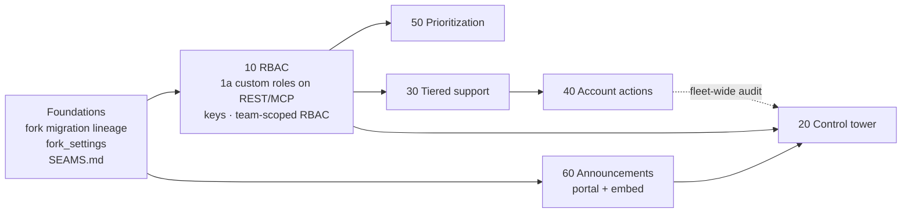

# Fork Plans — v2

v2 supersedes the original plans in `plans/v1/`. It fixes the issues found in the v1 review, records the
owner's decisions, and puts every feature under one set of fork conventions so that upstream Quackback
releases keep merging cleanly.

## Read in this order

| #   | Document                                                             | What it is                                                                   |
| --- | -------------------------------------------------------------------- | ---------------------------------------------------------------------------- |
| 00  | [`00-v1-review.md`](00-v1-review.md)                                 | Review of the six v1 plans against the code: cross-cutting and per-plan issues. |
| 01  | [`01-decisions.md`](01-decisions.md)                                 | Owner answers (✅), proposed defaults awaiting confirmation (🟡), pending (⏳). |
| 02  | [`02-fork-conventions.md`](02-fork-conventions.md)                   | **Binding** rules for all fork code: layout, migrations, seams, merge steps. |
| 03  | [`03-staff-review.md`](03-staff-review.md) · [original](REVIEW-2026-09-19.md) | Staff engineer review of v2 (summary + full original) and how each finding was resolved. |
| 04  | [`04-intranet-deployment.md`](04-intranet-deployment.md)             | Intranet, no-internet deployment: required fork changes, config baseline, features to disable. |
| —   | [`SEAMS.md`](SEAMS.md)                                               | Registry of every planned edit to upstream-owned files (merge checklist).     |
| 10  | [`10-rbac-persona-extensions.md`](10-rbac-persona-extensions.md)     | Custom roles on REST/MCP, fork permission keys, team-scoped RBAC, personas.  |
| 20  | [`20-control-tower.md`](20-control-tower.md)                         | Multi-app fleet: provisioner + separate control-tower app acting via MCP.   |
| 30  | [`30-tiered-support.md`](30-tiered-support.md)                       | Tier 1/2/3 on teams, ticket escalation, per-tier SLA and reporting, support hub. |
| 40  | [`40-support-account-actions.md`](40-support-account-actions.md)     | Tier-gated actions on accounts in connected customer apps, with request→approve. |
| 50  | [`50-prioritization-scoring.md`](50-prioritization-scoring.md)       | RICE (BRICE pending) scoring on posts, with Reach derived from votes.        |
| 60  | [`60-announcements-banner.md`](60-announcements-banner.md)           | Announcements banner (portal + embed), folding in live status incidents.     |

## Build order

1. **Foundations** (`02-fork-conventions.md` §3, §3.3a, §10): the fork migration lineage **and its production rollout** (image contents, `fork-migrate` with catalogue reconciliation, fork schema floor, suspended-tenant catch-up), the `fork_settings` table, the fork drift check, the shared seams F-1…F-11 (plus the fork-owned `Dockerfile.fork`), and `SEAMS.md`. Every later phase depends on this. **Fleet infrastructure and SSO spikes** (RDS Proxy, S3 via the registry, OIDC/SAML broker, no-consent OAuth, mail edge) start early, in parallel.
2. **10 RBAC.** Phase 1a (custom roles enforced on REST/MCP) is a security fix and a prerequisite for the tower's authorization model. Team-scoped RBAC must ship before tiers (D-T4).
3. **50 Prioritization.** Independent and lowest risk. A good first feature for proving out the conventions.
4. **30 Tiered support**, then **40 Account actions**, which needs tiers and team-scoped RBAC.
5. **60 Announcements**: the portal banner and embed can ship any time after Foundations.
6. **20 Control tower**: provisioner and pooled tenancy first, then the tower app. Its full product surfaces wait until the permission and tool contracts (10 Phase 1a, the capability → tool → permission table in 20) are proven by tests. Its announcements surface comes last.

## Status

All documents are **plans only**. Nothing is implemented. In `01-decisions.md`, ✅ items are decided, 🟡 items are
**adopted defaults** the plans are built on (the owner may still override them), and ⏳ items block the phases that
depend on them.

**Scope honesty.** Several capabilities arrive in later phases: workflow/macro escalation, non-close stage emails,
Quinn account actions and the tower portfolio view. An early release with manual escalation or a local-only banner
does **not** deliver the full requested capability set, and release notes must say so.

**Upgrade promise.** The fork is a *maintained, tested fork that can take upstream releases*, not a conflict-free
one. Every upgrade follows `02-fork-conventions.md` §7, including semantic review, negative authorization tests and
a populated-database upgrade rehearsal.
